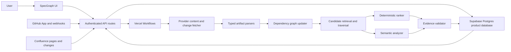

# SpecGraph MVP Implementation Plan

**Status:** Implementation — daily automatic source cadence implemented; production deployment and live Confluence-edit smoke test are next
**Last updated:** August 23, 2026
**Primary reference:** [SpecGraph Resume Project Assessment](./RESUME_PROJECT_ASSESSMENT.md)

## How to Use This Plan

- Check off a task only when its stated behavior is implemented and tested.
- Update the milestone status table at the start and end of each work session.
- Do not mark a milestone complete until every exit criterion passes.
- Add newly discovered work to the relevant milestone instead of expanding the active milestone silently.
- Record material architecture changes in the decision log at the bottom of this file.

Status legend:

- `[ ]` Not started
- `[x]` Complete
- `IN PROGRESS` should appear beside the one milestone currently being implemented
- `BLOCKED` should include the blocker and required decision

---

## 1. Product Goal

SpecGraph should be explainable in one sentence:

> When code or a specification changes, SpecGraph identifies which tests, documentation, APIs, and related artifacts may require updates and explains the supporting evidence.

The MVP is successful when it can take a real GitHub change through this complete path:

```text
GitHub push, pull request, Confluence page change, or manual analysis
        ↓
Fetch and parse changed artifacts
        ↓
Update a typed dependency graph
        ↓
Find and rank potentially affected artifacts
        ↓
Attach verified evidence and exact source links
        ↓
Persist the run and findings
        ↓
Display the result in the existing SpecGraph feed
```

The UI is already sufficient to support this flow. The immediate priority is product behavior, persistence, analysis quality, and operational credibility—not additional dashboard features.

---

## 2. MVP Scope

### Included in the first functional MVP

- One authenticated SpecGraph workspace.
- One or a small number of connected GitHub repositories.
- GitHub App installation and repository selection.
- Automatic discovery of Markdown, MDX, README, and OpenAPI documentation inside connected repositories.
- A guided documentation-source step that can connect one Confluence site and space or be skipped until later.
- Read-only Confluence page and version ingestion.
- Manual analysis of a branch, pull request, commit range, or supported file.
- Automatic analysis on a daily cadence from recorded GitHub pushes, pull requests, and polled Confluence page changes.
- Repository ingestion for:
  - TypeScript and JavaScript source files.
  - TypeScript and JavaScript test files.
  - Markdown and MDX documentation.
  - OpenAPI YAML, YML, and JSON documents.
- A typed dependency graph stored in the existing relational platform database.
- Deterministic relationships derived from imports, identifiers, links, schemas, endpoints, and tests.
- Semantic analysis for ambiguous relationships after deterministic candidate retrieval.
- Persistent runs, findings, evidence, source links, and review actions.
- Open, dismissed, and resolved finding states.
- Exact links to the relevant GitHub revision whenever possible.
- Polling for run progress; real-time sockets are not required.
- Unit, integration, end-to-end, and analysis-evaluation coverage.
- A stable recruiter-accessible deployment and project-specific README.

### Explicitly deferred

- Automatic file edits or pull-request creation.
- A broad connector marketplace.
- External documentation connectors beyond Confluence.
- Slack, email, or Teams notifications.
- A visual node-link graph editor.
- Full-repository semantic search.
- Real-time WebSocket updates.
- Complex roles, billing, or enterprise administration.
- Organization-wide repository discovery.
- Support for every programming language.

### Default product decisions

These defaults prevent the project from stalling. Change them only through the decision log.

| Area | Default decision | Reason |
| --- | --- | --- |
| First code source | GitHub App | Provides scoped access, webhooks, installation identity, and a credible production integration. |
| Repository documentation | Discover Markdown, MDX, README, and OpenAPI automatically | Users should not reconnect documentation that already lives beside their code. |
| First external documentation source | Confluence | Makes the cross-source product promise real without introducing a broad connector catalog. |
| Graph storage | Supabase Postgres relational tables | The MVP graph remains relational and bounded on portable SQL while the Vercel Marketplace integration manages production connection variables. |
| Artifact snapshots | Git commit SHA and provider revision links | GitHub already retains immutable revisions; add blob storage only when external documents require it. |
| Analysis strategy | Deterministic graph first, semantic model second | Improves explainability, precision, and cost control. |
| Run updates | Client polling | Simple and adequate for MVP-scale jobs. |
| Automatic checks | Once per day; manual Analyze remains immediate | Keeps the noncommercial MVP simple and low-noise without delaying an explicit user request. |
| Product action | Detect and explain only | Keeps the first release safe and measurable. |
| Initial tenancy | Auth.js GitHub identity with one private workspace per user | Authentication is explicit, portable, and server-enforced rather than supplied by a hosting-specific header. |
| Deployment direction | Vercel Hobby, Supabase Postgres, Auth.js, and Vercel Workflow | This noncommercial MVP gets a reproducible Next.js runtime, durable jobs, managed secrets, and a portable free-tier development database. |

### Minimal source-connection experience

The product should expose source setup progressively rather than presenting an integration dashboard. No provider owns the relationship, and source connection must work in any order.

1. **Add a source:** the single page-level **Add source** action opens a small dialog with **GitHub repository** and **Confluence documentation**.
2. **Authorize and choose:** selecting GitHub begins GitHub authorization and repository/branch selection; selecting Confluence begins Confluence authorization and site/space/page selection.
3. **Complete the relationship:** every connected group exposes exactly one **Connect source** action. It reopens the same provider chooser with the group selected; repository documentation is still included automatically with its GitHub source.
4. **Check connections:** show a simple preparing, connected, or needs-attention state.
5. **Use one feed:** changes from GitHub and Confluence enter the same Changes experience.

The Sources view displays equal peers vertically, joined by a restrained green connection:

```text
GitHub — StreetFighter-AI · main
             ↕
Confluence — Engineering / StreetFighter
             ↕
Notion — Product requirements
```

The group-level **Connect source** action appears once beneath the final member. A workspace with multiple products must never leave group membership implicit.

Every newly connected provider source begins in a singleton group. Connecting it to another singleton or existing group produces the same final membership regardless of order. Before creating a source or membership, SpecGraph compares canonical provider identities. Reconnecting the same provider scope or adding a source already present in the selected group is an idempotent no-op, and the UI explains that it is already connected there.

Group membership means “search for evidence among these sources.” It is not itself proof that their files or pages affect each other.

The page-level action must never say Connect GitHub once the provider dialog exists. The Add source dialog shows only usable MVP provider choices, explains each in one short line, and closes when authorization begins. It is a chooser, not an integrations dashboard.

The UI should never require users to understand ingestion, graph construction, webhooks, synchronization cursors, or analysis providers.

---

## 3. Current Baseline

### Already complete

- [x] Minimal black-and-white changes feed.
- [x] Open and All filtering.
- [x] Change details with progressively disclosed evidence.
- [x] Runs and Sources views.
- [x] Manual Analyze interaction prototype.
- [x] Responsive and accessible interaction states.
- [x] Component tests for the main UI behaviors.
- [x] Rendered HTML tests.
- [x] Standard Next.js and Vercel deployment scaffolding.
- [x] Drizzle and provider-neutral Postgres persistence, currently hosted by Supabase.
- [x] Auth.js GitHub identity and protected API helpers.
- [x] Persistent database schema and initial migration.
- [x] Authenticated personal workspace resolution.
- [x] Product read APIs and persisted finding actions.
- [x] Production UI backed by the API contract rather than fixtures.

### Still incomplete or absent

- [x] GitHub installation and repository connection.
- [x] Source ingestion and revision-aware synchronization.
- [x] Initial supported artifact parsers.
- [x] Initial typed dependency graph.
- [x] Manual durable analysis on the Vercel runtime.
- [x] Signed GitHub webhook ingestion with delivery deduplication.
- [x] Crash-safe durable execution with bounded workflow retries and persisted failures.
- [ ] Semantic candidate analysis.
- [ ] Evidence verification.
- [ ] Evaluation dataset and quality metrics.
- [ ] Product-specific README and public demonstration repository.

---

## 4. Target Architecture



### Architectural boundaries

1. **UI:** Displays state and submits commands; it does not fabricate domain records.
2. **API:** Authenticates, validates input, scopes queries, and persists commands.
3. **Provider adapters:** Encapsulate GitHub and Confluence authentication, API calls, change events, and canonical URLs.
4. **Ingestion:** Converts provider content into normalized artifacts and versions.
5. **Graph engine:** Creates typed relationships and traverses affected neighborhoods.
6. **Analysis engine:** Ranks candidate impacts and produces structured explanations.
7. **Evidence validator:** Verifies every stored excerpt against the fetched source revision.
8. **Job runner:** Owns status transitions, retries, timeouts, and failure recovery.
9. **Repositories:** Centralize database queries and tenant ownership checks.

### Suggested source layout

The exact names may evolve, but these responsibilities should remain separated:

```text
app/
  api/
    changes/
    runs/
    sources/
    webhooks/github/
    webhooks/confluence/
db/
  schema.ts
  repositories/
lib/
  auth/
  domain/
  github/
  confluence/
  ingestion/
  parsers/
  graph/
  analysis/
  jobs/
  evaluation/
tests/
  fixtures/
  integration/
  evaluation/
```

---

## 5. Domain and Data Model

The feed should be derived from analysis runs and findings. Do not introduce a separate feed table that duplicates product state.

| Entity | Purpose | Important fields |
| --- | --- | --- |
| `workspaces` | Tenant boundary for all product data | `id`, `name`, `createdAt` |
| `users` | Stable authenticated users | `id`, `providerUserId`, `email`, `displayName` |
| `workspace_members` | User-to-workspace authorization | `workspaceId`, `userId`, `role` |
| `sources` | Connected provider repositories or document spaces | `id`, `workspaceId`, `provider`, `externalId`, `name`, `defaultBranch`, `status`, `lastSyncedAt` |
| `source_groups` | Provider-neutral sets of sources that should be checked together | `id`, `workspaceId`, timestamps |
| `source_group_members` | One source's membership in exactly one connected group | `workspaceId`, `groupId`, `sourceId`, `createdAt` |
| `artifacts` | Provider-backed files or pages and their provenance | `id`, `sourceId`, `externalId`, `kind`, `path`, `title`, `canonicalUrl`, `currentRevision`, `contentHash` |
| `artifact_versions` | Revision metadata and extracted content needed for comparison | `id`, `artifactId`, `revision`, `contentHash`, `extractedText`, `createdAt` |
| `graph_nodes` | Typed addressable units inside artifacts | `id`, `artifactId`, `stableKey`, `kind`, `name`, `startLine`, `endLine`, `contentHash` |
| `relationships` | Directed typed graph edges between nodes | `fromNodeId`, `toNodeId`, `type`, `origin`, `provenance`, `analyzerVersion`, `confidence`, `evidence` |
| `change_events` | Normalized push, pull request, or manual change input | `id`, `sourceId`, `trigger`, `beforeRevision`, `afterRevision`, `actor`, `occurredAt` |
| `analysis_runs` | Durable unit of background work | `id`, `workspaceId`, `sourceId`, `changeEventId`, `target`, `status`, `progress`, `attempts`, `errorCode`, timestamps |
| `run_attempts` | Retry and stage-level execution history | `id`, `runId`, `attempt`, `stage`, `status`, `errorCode`, `startedAt`, `finishedAt` |
| `findings` | A changed node's potential impact on another node | `id`, `runId`, `changedNodeId`, `affectedNodeId`, `summary`, `confidence`, `origin`, `provenance`, `analyzerVersion`, `status`, `deduplicationKey` |
| `finding_evidence` | One or more verifiable excerpts supporting a finding | `id`, `findingId`, `artifactVersionId`, `startLine`, `endLine`, `excerpt`, `sourceUrl`, `type` |
| `semantic_analysis_attempts` | Analyzer audit and cost telemetry, including safe fallbacks | `runId`, `changedNodeId`, `analyzerVersion`, `model`, `status`, candidate/decision counts, `latencyMs`, token usage, estimated cost, `failureReason` |
| `finding_actions` | Review history and audit trail | `id`, `findingId`, `userId`, `action`, `note`, `createdAt` |
| `webhook_deliveries` | Signature verification and idempotency record | `providerDeliveryId`, `eventType`, `payloadHash`, `status`, `receivedAt`, `processedAt` |
| `evaluation_cases` | Labeled expected impacts | `id`, `repository`, `beforeRevision`, `afterRevision`, `expectedArtifactIds` |
| `evaluation_results` | Reproducible quality measurements | `caseId`, `analyzerVersion`, `predictedArtifactIds`, `latencyMs`, `createdAt` |

### Required constraints and indexes

- [ ] Every product table is scoped directly or indirectly to a workspace.
- [ ] Provider source IDs are unique within a workspace.
- [x] Every connected source belongs to exactly one workspace-safe source group.
- [x] Group membership limits analysis scope but never counts as artifact-level relationship evidence.
- [ ] Artifact external IDs are unique within a source.
- [ ] Artifact versions are unique by artifact and revision.
- [ ] Graph node stable keys are unique within an artifact.
- [ ] Relationships are unique by source node, target node, type, and origin.
- [ ] Provider webhook delivery IDs are unique.
- [ ] Open findings are indexed by workspace, status, and creation time.
- [ ] Runs are indexed by workspace, status, and creation time.
- [ ] All delete behavior is explicitly defined; no accidental orphaned evidence.

### State models

```text
Source:  pending → syncing → connected
                     ↘ error → syncing
                     ↘ disconnected

Run:     queued → running → succeeded
                    ↘ failed → queued (retry)

Finding: open → resolved
              ↘ dismissed
        resolved/dismissed → open (reopen)
```

---

## 6. API Contract

All write routes must authenticate the user, resolve their workspace server-side, validate input, and reject cross-workspace identifiers.

| Method and route | Purpose | MVP response behavior |
| --- | --- | --- |
| `GET /api/changes?status=open|all` | Load the feed | Paginated findings grouped by change/run with affected counts and status |
| `GET /api/changes/:id` | Load finding details | Changed artifact, affected artifacts, evidence, and exact source URLs |
| `PATCH /api/changes/:id` | Dismiss, resolve, or reopen | Persist action and return updated state |
| `GET /api/runs` | Load recent activity | Paginated manual and automatic runs |
| `POST /api/runs` | Start manual analysis | Validate source and target, persist a queued run, return its ID |
| `GET /api/runs/:id` | Poll run status | Status, progress, findings count, and safe failure message |
| `GET /api/sources` | Load connected sources | Real connection and synchronization state |
| `POST /api/sources/github/install` | Begin GitHub installation | Return or redirect to the GitHub App installation flow |
| `GET /api/sources/github/callback` | Complete installation | Validate state, persist installation metadata, begin initial sync |
| `POST /api/sources/confluence/connect` | Begin Confluence connection | Return or redirect to the read-only Confluence authorization flow |
| `GET /api/sources/confluence/callback` | Complete Confluence connection | Validate state, select a site/space, and begin initial page sync |
| `DELETE /api/sources/:id` | Disconnect a source | Revoke or detach access and retain/delete data according to policy |
| `POST /api/webhooks/github` | Receive GitHub events | Verify signature, deduplicate delivery, persist event, enqueue run |
| `POST /api/webhooks/confluence` | Receive or normalize Confluence changes | Verify the event when supported, deduplicate it, and enqueue the same analysis pipeline |

### Contract rules

- [ ] Dates are absolute timestamps in APIs; relative labels are calculated by the UI.
- [ ] IDs are durable server-generated values, never `Date.now()` client IDs.
- [ ] Every artifact response includes a provider URL when one exists.
- [ ] Processing states come only from persisted run status.
- [ ] Errors use stable codes plus user-safe messages.
- [ ] List routes use deterministic ordering and cursor pagination.
- [ ] Provider-specific shapes stay inside provider adapters.

---

## 7. Analysis Pipeline

### Ingestion and normalization

1. Resolve the exact connected source and revisions for the run target.
2. Fetch only relevant changed files or pages plus the artifacts needed for indexing.
3. Classify supported files by artifact kind.
4. Normalize content into file-, section-, symbol-, endpoint-, schema-, and test-level records.
5. Hash normalized content to skip unchanged artifacts.
6. Upsert artifact versions and remove or tombstone deleted artifacts.
7. Rebuild only relationships affected by the changed artifacts.

### Deterministic relationship extraction

- [x] TypeScript/JavaScript imports and exports.
- [x] Exact documented identifiers mapped to persisted code symbol nodes.
- [x] Test-to-source relationships from imports and naming conventions.
- [x] Markdown links and referenced file paths.
- [x] OpenAPI path, operation, request, response, and schema references.
- [x] Identical endpoint names, schema names, constants, and documented identifiers.
- [x] Explicit documentation references to another artifact.

Every deterministic edge stores its type and the exact evidence used to create it.

### Candidate retrieval

1. Map changed lines or diff hunks to normalized graph nodes.
2. Traverse typed edges within a configured maximum depth.
3. Add exact identifier, path, schema, and endpoint matches.
4. Deduplicate candidates.
5. Apply cheap deterministic ranking before any model call.
6. Send only ambiguous, bounded candidates to semantic analysis.

### Impact ranking

Initial ranking inputs:

- Relationship type and whether it is deterministic or model-derived.
- Graph distance from the changed artifact.
- Changed-line overlap with the linked symbol or section.
- Exact identifier or endpoint matches.
- Artifact kind and expected dependency direction.
- Semantic confidence.
- Whether multiple independent signals support the same finding.

### Semantic analysis guardrails

- [x] Use a strict structured-output schema.
- [x] Provide bounded changed text, candidate text, relationship context, and revision metadata.
- [x] Require an impact decision, concise explanation, and exact supporting excerpts.
- [x] Verify every returned excerpt against source text before persistence.
- [x] Reject unsupported evidence instead of displaying it.
- [x] Mark model-derived relationships separately from deterministic relationships.
- [x] Fall back to deterministic results when the model is unavailable.
- [x] Record model, prompt/analyzer version, latency, token usage, estimated cost, and failure reason.

---

## 8. Milestone Roadmap

### Milestone status

| Milestone | Status | Depends on | Primary outcome |
| --- | --- | --- | --- |
| M0 — Contract and test seam | In progress | Current prototype | UI no longer owns product fixtures or domain behavior |
| M1 — Persistence and identity | In progress | M0 | State survives reload and is tenant-scoped |
| M2 — GitHub connection and ingestion | Complete | M1 | One real repository is connected and indexed |
| H1 — Hosting migration | Vercel auth, repository sync, and GitHub webhook smoke passed; Confluence and remaining lifecycle smoke pending | M2 | The application runs outside Sites with portable auth, persistence, secrets, and callbacks |
| M3 — Deterministic graph | Relationship-quality baseline complete; incremental indexing remains | M2 | Supported artifacts have queryable typed relationships |
| M4 — Manual end-to-end analysis | Staging implementation complete; live smoke pending | M3, H1 | Analyze produces persistent real findings on the durable replacement runtime |
| M5 — Automatic GitHub feed | Complete — live push processed exactly once and produced persistent findings | M4 | Pushes and pull requests trigger the same pipeline |
| M6 — Confluence documentation connection | In progress (live connection and both directions implemented; live edit smoke pending) | M4, H1 | External documentation participates in the same product flow on the replacement domain |
| M7 — Semantic ranking and evidence | Foundation complete; live model adapter and comparative evaluation pending | M4, M6 | Ambiguous cross-source impacts are ranked with verified evidence |
| M8 — Review lifecycle and resilience | In progress — review actions, bounded retries, ten-minute execution deadlines, stale-worker cancellation, recovery coverage, and correlation logs are implemented; the materially-new-change review policy remains | M5, M7 | Actions persist; failures retry safely |
| M9 — Evaluation and production hardening | Not started | M8 | Quality, security, and reliability are measured |
| M10 — Portfolio and resume readiness | Not started | M6, M9 | Recruiters can inspect the complete cross-source product |

### M0 — Contract and Test Seam

Goal: separate the current interface from its mock implementation so real data can replace fixtures without rewriting the UI.

- [x] Move domain types out of `app/page.tsx`.
- [x] Move demo fixtures into test-only or development-only modules.
- [x] Define DTOs for sources, runs, changes, artifacts, and findings.
- [ ] Freeze supported file types, triggers, target shapes, and initial repository-size limits.
- [ ] Create two golden test changes: code-to-doc/test and documentation-to-code/test.
- [ ] Record the expected nodes, edges, and findings for both golden changes.
- [x] Introduce a small data-access boundary used by the UI.
- [x] Replace hardcoded relative times with timestamps plus formatting.
- [x] Define loading, empty, processing, error, and retry states.
- [x] Update component tests to mock API contracts rather than importing production fixtures.
- [ ] Document API and domain naming conventions.

Exit criteria:

- [x] Production UI code contains no hardcoded product records.
- [x] Existing UI behaviors still pass against mocked API responses.
- [x] A failed API request has a clear, minimal user-visible state.
- [ ] Both golden changes have reviewed expected outputs before analyzer work begins.

### M1 — Persistence and Identity

Goal: establish durable, authenticated product state.

- [x] Provision portable Postgres persistence and configure pooled application and direct migration URLs; production currently uses Supabase.
- [x] Implement the core Drizzle schema and enums.
- [x] Generate and inspect the initial SQL migration.
- [x] Add repository modules for sources, runs, findings, and actions.
- [x] Resolve stable user identity from an Auth.js GitHub session.
- [x] Create or resolve a default workspace for the authenticated user.
- [x] Enforce workspace ownership in every repository query.
- [x] Implement real read APIs for changes, runs, and sources.
- [x] Implement persisted finding state changes.
- [ ] Add a local development seed command that is never used in production.
- [x] Add database and route integration tests.

Exit criteria:

- [x] Feed, Runs, and Sources load from the production Postgres database.
- [x] A finding action survives page refresh.
- [x] One user cannot access another workspace's IDs in integration tests.
- [ ] Migrations work against a fresh database and an existing local database.

### M2 — GitHub Connection and Ingestion

Goal: connect and index one real repository securely.

- [x] Create and configure a GitHub App with minimum required permissions.
- [x] Implement installation state validation and callback handling.
- [x] Persist installation and selected repository metadata without storing long-lived tokens in plaintext.
- [x] Add a repository picker limited to the installation's accessible repositories.
- [x] Implement a `SourceProvider` interface.
- [x] Implement the GitHub provider adapter.
- [x] Fetch repository metadata and the default branch.
- [x] Enumerate supported files without downloading ignored or oversized content.
- [x] Store normalized artifact metadata, revision, hash, and canonical URL.
- [x] Report initial-sync progress and failures truthfully in Sources.
- [x] Add recorded provider fixtures and adapter contract tests.
- [x] Add disconnect behavior and document its data-retention policy.

Exit criteria:

- [x] A real GitHub repository can be connected through the UI.
- [x] Supported files appear as persisted artifacts in the integration harness.
- [x] Every indexed artifact has a revision and immutable source URL in the integration harness.
- [x] Re-running ingestion skips unchanged content.

### H1 — Hosting Migration

Goal: move SpecGraph away from OpenAI Sites without losing the working product or binding the architecture prematurely to another vendor.

The existing Sites deployment remains available as rollback until GitHub authentication, repository connection, sync, analysis, and webhooks pass on the stable Vercel domain. Do not delete the Sites project during that verification window.

- [x] Inventory Sites-specific dependencies: vinext/Worker output, authenticated-user headers, D1 bindings, runtime environment access, deployment packaging, and the current domain.
- [x] Select Vercel Hobby, provider-neutral Postgres, Auth.js GitHub sign-in, Vercel Workflow, and Vercel secret management as one compatible system; Supabase is the current Postgres host.
- [x] Keep product repositories and provider adapters independent from the hosting runtime through small auth, database, job, and environment boundaries.
- [x] Start the replacement Postgres environment from an empty schema; the former D1 and quota-blocked Neon data are disposable staging data and are not migrated.
- [x] Run all migrations from an empty replacement database and verify workspace idempotency, source-group deduplication, evidence links, review persistence, and run retries against Postgres.
- [x] Configure GitHub App credentials and update its homepage, OAuth callback, and webhook URL for the replacement domain.
- [ ] Configure Confluence OAuth callbacks against the replacement domain before production Confluence authorization begins.
- [x] Provide durable source-sync, manual-analysis, and GitHub-webhook workflows that do not depend on an HTTP request remaining alive.
- [x] Recreate database, GitHub App, webhook, and Auth.js secrets in Vercel Preview and Production as sensitive values.
- [ ] Deploy a staging environment from the GitHub repository and run the complete repository connection, sync, analysis, persistence, and removal smoke test.
- [x] Deploy the replacement at `https://spec-graph.vercel.app`; keep the Sites deployment available for rollback during the verification window.
- [ ] Retire the Sites deployment and remove Sites-only configuration only after callbacks, data, authentication, and observability are confirmed on the replacement.

Exit criteria:

- [x] A clean GitHub checkout builds and deploys with standard Next.js tooling; removal of archived Sites-only files waits for the live smoke gate.
- [x] Authentication and workspace identity are server-enforced through Auth.js and workspace-scoped repositories.
- [x] Structured data persists across deploys and migrations in Supabase Postgres.
- [ ] GitHub and Confluence callbacks use the replacement domain.
- [x] Background jobs and bounded retries use Vercel Workflow without request-lifetime coupling; live log inspection remains part of the smoke test.
- [ ] The end-to-end smoke test passes before Sites is decommissioned.

### M3 — Deterministic Dependency Graph

Goal: produce useful, explainable graph edges without relying on an LLM.

- [x] Implement a common parser output contract.
- [x] Implement TypeScript/JavaScript file, import, export, dynamic import, and path-alias parsing.
- [x] Implement test-file classification and deterministic test-to-source linking.
- [x] Implement Markdown/MDX heading, link, and identifier parsing.
- [x] Implement OpenAPI operation, schema, and `$ref` parsing.
- [x] Map parsed OpenAPI objects to stable relationship identifiers.
- [x] Upsert deterministic OpenAPI relationships with evidence.
- [x] Remove stale relationships after artifact changes or deletion.
- [x] Implement bounded graph traversal.
- [x] Implement deterministic candidate scoring.
- [x] Add focused parser, graph, stale-edge, traversal, and ranking tests. True affected-region-only indexing remains separate optimization work.

Exit criteria:

- [x] Reviewed fixtures produce the expected nodes, edges, and ranked candidates deterministically.
- [x] A changed OpenAPI schema can locate only the documentation linked to its schema or referencing operations.
- [x] A changed Markdown statement can locate linked code, schema, tests, or peer documentation when explicit relationships exist.
- [ ] Incremental indexing updates only affected graph regions.

### M4 — Manual End-to-End Analysis

Goal: make the existing Analyze action perform genuine backend work.

- [ ] Validate manual targets as branch, pull request, revision range, supported path, or provider document/page.
- [x] Persist a queued run before starting work.
- [ ] Implement job claiming and safe status transitions.
- [x] Fetch the exact before and after revisions.
- [x] Create a normalized change event.
- [ ] Map diff hunks to changed graph nodes.
- [ ] Retrieve and rank deterministic candidate impacts.
- [x] Persist findings, evidence, and source links.
- [x] Poll run status from the UI.
- [x] Replace the mock processing row with persisted state.
- [x] Load completed findings into the existing feed.
- [ ] Show useful failure and retry states.
- [x] Add an integration test from submitted run through persisted finding.

Exit criteria — the walking skeleton:

- [ ] Connect a real repository.
- [ ] Submit a real pull request, branch, or commit range.
- [ ] Observe queued and running states.
- [x] Receive at least one deterministic finding when the fixture change warrants it.
- [x] Open the affected artifact at the exact GitHub revision.
- [ ] Refresh the app without losing the run or finding.

### M5 — Automatic GitHub Feed

Goal: create feed items automatically when relevant code or documentation changes.

- [x] Add the GitHub webhook endpoint.
- [x] Verify every webhook signature before processing.
- [x] Persist delivery metadata before acknowledging the event.
- [x] Deduplicate repeated provider delivery IDs.
- [x] Normalize supported push events.
- [x] Normalize supported pull-request events.
- [x] Ignore unsupported events explicitly and observably.
- [x] Enqueue automatic runs through the same run lifecycle used by manual runs.
- [x] Preserve actor, repository, branch, PR, and revision context.
- [x] Add webhook signature, replay, idempotency, and event-shape tests.

Exit criteria:

- [ ] A real push or pull-request update creates one and only one run. Local built-worker coverage passes; live GitHub App activation remains.
- [x] The run appears in Runs without a page refresh after the next poll.
- [x] Completed findings appear in the same feed as manual findings.
- [x] Code-first and repository-documentation-first changes use the same pipeline.

### M6 — Confluence Documentation Connection

Goal: let users connect external documentation without making source setup feel technical or complex.

- [x] Replace the page-level Connect GitHub/Add repository action with one Add source action.
- [x] Open an accessible provider dialog containing GitHub repository and Confluence documentation choices.
- [x] Route GitHub selection into GitHub authorization and repository/branch selection.
- [x] Route Confluence selection into Confluence authorization and site/space selection; live callback activation remains gated on credentials.
- [x] Reuse the same provider dialog for every group-level Connect source action without assuming a missing provider type.
- [ ] Add the onboarding question: Where are your docs?
- [x] Explain that documentation inside GitHub is already included.
- [ ] Offer Connect Confluence and Not now as the only additional choices.
- [x] Show exactly one Connect source action for every connected group.
- [x] Persist provider-neutral source groups and memberships; never infer relationships from provider or connection order.
- [x] Display GitHub and Confluence vertically as equal peers joined by the same visual connection.
- [x] Support code-first, documentation-first, and documentation-to-documentation grouping.
- [x] Canonicalize GitHub repository and Confluence site/space/page identities before writes.
- [x] Enforce canonical provider-source uniqueness and one group membership per source in Postgres.
- [ ] Make repeated connection callbacks and group-membership requests idempotent under retries and concurrent submissions.
- [x] When a source is already in the selected group, report that it is already connected there.
- [x] Implement read-only Confluence authorization and state validation locally; activate production callbacks after H1.
- [x] Let the user select one accessible site and space.
- [x] Persist Confluence source metadata without exposing credentials to the browser.
- [x] Ingest page IDs, versions, titles, text, explicit links, and canonical URLs.
- [x] Normalize Confluence pages through the same artifact and graph-node contracts used for repository documentation.
- [ ] Store durable external page snapshots when immutable provider retrieval is insufficient.
- [x] Create deterministic relationships when Confluence pages reference exact paths in a GitHub source from the same group.
- [x] Poll for incremental page versions on a daily cadence and deduplicate them with per-artifact analysis cursors.
- [x] Send Confluence changes through the same run and finding pipeline.
- [x] Display GitHub and Confluence as simple connected sources with truthful health states.
- [x] Show a source choice in Analyze only when more than one connected source makes it necessary.
- [x] Add Confluence authorization, sync, encrypted-token, group-membership, deduplication, and scheduled change-event tests.

Exit criteria:

- [ ] Add source is the only generic page-level connection action and both provider choices start the correct authorization flow.
- [ ] Repository documentation is included automatically after GitHub connection.
- [x] A user can connect one Confluence space through the Sources experience.
- [x] A user can add another provider source from an already-connected group.
- [x] Each source is visibly and durably assigned to exactly one provider-neutral group.
- [x] Connecting Confluence first and GitHub second produces the same normalized membership as GitHub-first setup.
- [x] Repeating either order does not duplicate sources or group memberships.
- [x] An attempted duplicate clearly identifies that the source is already in the selected group.
- [ ] A Confluence page edit can create findings against linked primary code, schemas, or peer documentation; related tests remain supporting review context rather than separate suggestions.
- [x] A code change can identify an affected Confluence page.
- [ ] Every cross-source finding opens the correct GitHub revision or Confluence page/version.
- [ ] Users who select Not now can use the GitHub-only workflow without warnings or fake source rows.

### M7 — Semantic Ranking and Verified Evidence

Goal: find meaningful relationships that explicit parsing cannot capture without sacrificing trust.

- [x] Freeze the structured semantic-analysis input and output schemas.
- [x] Introduce bounded semantic candidate generation.
- [x] Add the model call behind an analyzer interface; a live provider remains intentionally unconfigured.
- [x] Version prompts and analyzer configuration.
- [x] Distinguish deterministic, semantic, and hybrid findings.
- [x] Verify returned evidence against exact source revisions.
- [x] Reject or downgrade unsupported model output.
- [x] Combine graph distance, edge origin, lexical overlap, and semantic score into final ranking.
- [x] Establish confidence thresholds for display and suppression.
- [x] Record latency, usage, estimated cost, and failure reason.
- [x] Add deterministic fallback behavior.
- [x] Add adversarial fixtures for hallucinated evidence and irrelevant matches.

Exit criteria:

- [x] No displayed semantic finding lacks verified source evidence; persistence only accepts byte-exact excerpts from the supplied revisions.
- [ ] Semantic analysis improves recall on the labeled set without unacceptable precision loss.
- [ ] A model outage still returns deterministic findings and a truthful run status.

### M8 — Review Lifecycle and Operational Resilience

Goal: make the product usable over repeated runs and credible under failure.

- [x] Persist dismiss, resolve, and reopen actions.
- [x] Record the actor and timestamp for every action.
- [x] Make Open and All filters query real persisted states.
- [x] Scope dismiss and resolve decisions to an impact fingerprint: identical revisions and evidence retain the prior review decision, while a materially new revision or verified evidence creates a fresh open suggestion without rewriting history.
- [x] Add durable retry policies with capped attempts and backoff.
- [x] Prevent two workers from completing the same run concurrently.
- [x] Add timeout and cancellation handling.
- [x] Surface safe failure details and an explicit retry action.
- [x] Record terminal failures for investigation.
- [x] Add structured logs with run, source, workspace, and provider-delivery correlation IDs.
- [x] Display real source synchronization health and last-checked time.

Exit criteria:

- [x] Review actions survive reload and future sessions.
- [x] Duplicate jobs and webhooks do not duplicate findings.
- [x] Transient failures retry and recover in an integration test.
- [x] Permanent failures are visible without exposing secrets.

### M9 — Evaluation and Production Hardening

**Status:** The 25-case local corpus, retrieval baseline, live analyzer
comparison, latency measurement, and decision diagnostics are complete;
remaining production hardening is pending.

Goal: measure analysis quality and demonstrate secure, production-style engineering.

- [x] Create a labeled evaluation set of at least 25 representative changes.
- [x] Include code-first, documentation-first, OpenAPI, test, unrelated, and ambiguous changes.
- [x] Record expected affected artifacts for every case.
- [x] Build a repeatable evaluation command.
- [x] Report precision, recall, F1, false-positive rate, evidence coverage, and latency.
- [x] Compare deterministic-only and hybrid analyzer results.
- [x] Trace each evaluated candidate through model classification, exact-evidence verification, combined confidence, and final disposition without logging source content.
- [x] Add candidate-retrieval regression thresholds that fail when reviewed-target recall drops, candidate sets grow beyond the bound, or unrelated retrieval expands; final analyzer thresholds remain pending.
- [ ] Add repository size and incremental-index timing measurements.
- [ ] Enforce request and webhook rate limits.
- [ ] Audit tenant isolation and repository authorization.
- [ ] Audit secret and token handling.
- [ ] Add retention and deletion behavior.
- [ ] Add health, error-rate, retry-rate, latency, and cost telemetry.
- [ ] Document known failure modes and limitations.

Initial quality targets, to be validated rather than claimed:

| Metric | Initial target |
| --- | --- |
| Evidence coverage | 100% of displayed findings |
| Precision | At least 80% on the labeled set |
| Recall | At least 70% on the labeled set |
| Duplicate findings after webhook replay | 0 |
| Successful recovery from tested transient failures | 100% |
| Median incremental analysis latency | Under 60 seconds for the demo repository |

Exit criteria:

- [ ] Evaluation results are reproducible from a clean checkout.
- [ ] Quality and latency metrics come from recorded runs, not estimates.
- [ ] Security and failure-recovery checklist is complete.
- [ ] Known limitations are documented honestly.

### M10 — Portfolio and Resume Readiness

Goal: make the implementation independently verifiable by recruiters and interviewers.

- [x] Replace the starter README with a SpecGraph README.
- [x] Include the one-sentence problem statement; add the final product demo after live smoke testing.
- [x] Document the current architecture, data flow, and deterministic analysis tradeoff; expand the graph model with evaluation results later.
- [x] Document local setup, tests, migrations, and deployment; add evaluation commands when the harness exists.
- [x] Document the Vercel, Neon, Auth.js, and Workflow replacement architecture and remaining Sites retirement gate.
- [ ] Include screenshots or a short demo recording.
- [x] Publish measured evaluation and latency results.
- [ ] Document security choices and known limitations.
- [ ] Provide a safe demo repository with representative changes.
- [ ] Make the application public or recruiter-accessible.
- [ ] Make the source repository public or provide a verifiable review path.
- [ ] Gather feedback from at least three external testers if feasible.
- [ ] Write resume bullets only after replacing every placeholder with measured results.

Resume-ready gate:

- [ ] A reviewer can connect or inspect a real repository and external documentation flow.
- [x] A real manual or webhook-triggered run produces persistent findings.
- [ ] Code-first and Confluence-first changes both produce findings in the same feed.
- [ ] The graph and ranking implementation can be explained from source code.
- [ ] Findings contain exact evidence and revision links.
- [ ] Automated tests cover the pipeline, not only the UI.
- [ ] Evaluation quality and latency are published.
- [ ] The deployment and repository are stable and independently inspectable.

---

## 9. Testing Strategy

### Unit tests

- Parsers for each supported artifact format.
- Diff-to-node mapping.
- Relationship extraction and stale-edge removal.
- Graph traversal, ranking, and confidence thresholds.
- Evidence excerpt verification.
- Status transition rules.
- Authorization and input validation helpers.
- Webhook signature verification and delivery deduplication.

### Integration tests

- Fresh migration and database upgrade path.
- Workspace-scoped repository queries.
- Connect source and initial ingestion using recorded GitHub fixtures.
- Connect Confluence and ingest repository-linked documentation using recorded provider fixtures.
- Manual run through persisted findings.
- Webhook receipt through queued analysis.
- Retry and terminal failure behavior.
- Dismiss, resolve, and reopen persistence.
- Provider rate-limit and expired-credential handling.

### End-to-end tests

1. Sign in and connect a repository.
2. Confirm repository documentation is included automatically.
3. Connect a Confluence space.
4. Run a manual analysis against a known pull request.
5. Observe processing and completed states.
6. Open GitHub and Confluence findings and follow their source links.
7. Dismiss a finding and verify persistence after reload.
8. Replay a provider event and verify no duplicate run or finding appears.

### Evaluation tests

- Use versioned, labeled change cases rather than subjective screenshots.
- Keep expected affected artifacts separate from analyzer output.
- Run deterministic-only and hybrid variants against the same dataset.
- Preserve analyzer and prompt versions with each result.
- Review false positives and false negatives before changing thresholds.

---

## 10. Security and Reliability Checklist

- [ ] Use least-privilege GitHub App permissions.
- [ ] Verify GitHub signatures with constant-time comparison.
- [ ] Validate installation state and callback parameters.
- [ ] Never expose provider tokens to the browser.
- [ ] Never log credentials, raw authorization headers, or webhook secrets.
- [ ] Scope every database operation by workspace.
- [ ] Validate that requested repository resources belong to the connected installation.
- [ ] Limit fetched file size, file count, and supported extensions.
- [ ] Defend against path traversal and unsafe archive extraction.
- [ ] Rate-limit manual runs and webhook endpoints.
- [ ] Deduplicate webhook deliveries and run claims.
- [ ] Cap graph traversal depth and semantic candidate count.
- [ ] Add timeouts, retries, and terminal failure handling.
- [ ] Treat source text and repository instructions as untrusted data.
- [ ] Require verified evidence before displaying model-derived claims.
- [ ] Define repository disconnect, deletion, and retention behavior.

---

## 11. Metrics and Observability

### Product metrics

- Repositories connected.
- Pull requests, pushes, and manual targets analyzed.
- Findings created, opened, resolved, dismissed, and reopened.
- Acceptance or dismissal rate by finding origin.
- Percentage of runs producing useful findings.

### Graph and ingestion metrics

- Files and artifact nodes indexed.
- Relationships by type and origin.
- Initial ingestion time.
- Incremental update time.
- Files skipped by reason.

### Analysis metrics

- End-to-end and stage-level latency.
- Candidate count before and after deterministic ranking.
- Precision, recall, F1, and false-positive rate.
- Evidence validation pass rate.
- Model usage, estimated cost, and failure rate.
- Deterministic-only versus hybrid quality.

### Reliability metrics

- Webhook delivery count and duplicate rate.
- Run success, retry, and terminal failure rates.
- Queue age and job duration.
- Provider rate-limit and authentication failures.
- Recovery time for tested transient failures.

---

## 12. Risk Register

| Risk | Impact | Mitigation |
| --- | --- | --- |
| Parser scope grows across languages | Delays the end-to-end MVP | Limit the first release to TypeScript/JavaScript, Markdown/MDX, OpenAPI, and tests. |
| Semantic analysis produces unsupported claims | Destroys user trust | Retrieve bounded candidates, require exact evidence, verify excerpts, and reject unsupported output. |
| Too many weak graph edges create noisy findings | Low precision and poor demos | Separate deterministic and semantic edges, cap traversal, tune on a labeled dataset, and suppress below threshold. |
| Background work is not durable | Stuck processing states or lost analyses | Persist jobs before execution and move to a durable queue/runner before beta. |
| GitHub token or permission mistakes | Security and reviewer concerns | Use a least-privilege GitHub App, keep tokens server-side, and test authorization boundaries. |
| Webhook retries duplicate results | Confusing feed and bad metrics | Deduplicate delivery IDs and enforce uniqueness on runs/findings. |
| Large repositories exceed runtime limits | Failed syncs and slow demos | Apply file limits, ignore rules, incremental hashing, bounded candidate retrieval, and clear supported-size limits. |
| External documentation integration stalls the core pipeline | The product never reaches a working end-to-end state | Build the GitHub walking skeleton first, then add Confluence as the required M6 source adapter before resume readiness. |
| UI polishing consumes backend time | Project remains a prototype | Freeze the current visual system until the walking skeleton passes. |
| Resume bullets get ahead of implementation | Credibility risk | Use only measured results from M9 and implemented capabilities from M10. |

---

## 13. Delivery Gates

### Gate A — Persistent application

- [ ] Real authenticated data replaces production fixtures.
- [ ] Changes, runs, and source state survive reload.
- [ ] Finding actions persist.

### Gate B — Functional GitHub MVP

- [ ] One real repository connects and indexes successfully.
- [ ] Manual analysis produces graph-derived findings.
- [ ] Exact evidence and revision links are displayed.

### Gate C — Automatic private beta

- [ ] Signed push and pull-request webhooks trigger durable runs.
- [ ] Duplicate deliveries are harmless.
- [ ] Failures retry and surface truthful status.

### Gate D — Resume-ready flagship project

- [ ] GitHub repository documentation is included automatically.
- [ ] A user can connect an external Confluence documentation source.
- [ ] Code-first and external-documentation-first changes both produce linked findings.
- [ ] Hybrid analysis is evaluated on a labeled dataset.
- [ ] Quality, latency, and reliability metrics are published.
- [ ] The deployment and source are independently inspectable.
- [ ] The README explains architecture, tradeoffs, security, and limitations.

---

## 14. Rough Delivery Estimate

These are planning ranges, not commitments. They assume focused implementation and one primary developer.

| Outcome | Estimated focused engineering time |
| --- | --- |
| Persistent UI and API foundation | 1–3 days |
| GitHub connection and initial ingestion | 2–4 days |
| Deterministic graph and manual walking skeleton | 4–7 days |
| Automatic webhooks and operational resilience | 2–4 days |
| Semantic analysis and evaluation harness | 3–6 days |
| Confluence connection and cross-source synchronization | 3–5 days |
| Portfolio documentation and demo preparation | 1–3 days |
| GitHub-only functional milestone | Approximately 10–15 focused days |
| Complete GitHub and Confluence resume-ready version | Approximately 18–27 focused days |

---

## 15. Immediate Next Work Package

Do not begin with the model or Confluence adapter. The next implementation package should establish the provider-neutral seam that both GitHub and external documentation will use.

### Package 1 — Contracts, persistence, and real reads

- [x] Freeze the domain DTOs.
- [x] Move mock records out of production UI code.
- [x] Implement the initial schema and migration.
- [x] Add authenticated workspace resolution.
- [x] Add source, run, finding, and action repositories.
- [x] Add read APIs and finding-state mutation.
- [x] Rewire the existing UI to those APIs.
- [x] Preserve component tests with API mocks.
- [x] Add database and route integration tests.

Package 1 is complete when the current UI behaves the same way using persisted server data and retains every state change after a reload.

### Package 2 — GitHub walking skeleton

**Status:** In progress — implementation and simulated end-to-end coverage complete; GitHub App credentials and a real repository smoke test remain.

- [ ] Connect one repository through a GitHub App.
- [ ] Ingest supported artifacts and canonical links.
- [ ] Create a minimal deterministic graph.
- [ ] Analyze one real pull request manually.
- [ ] Persist and display at least one evidence-backed finding.

Package 2 is complete when a recruiter can be shown a real repository change moving through the product from input to linked result.

### Package 3 — External documentation connection

Hosting gate: provider-neutral Package 3 contracts and local tests may begin before H1 completes, but do not register production Confluence callbacks or publish the connection flow until the replacement domain and secret store are ready.

- [x] Replace Connect GitHub/Add repository with an Add source provider dialog.
- [x] Offer GitHub repository and Confluence documentation as the two clear, actionable choices.
- [ ] Add the minimal Where are your docs? onboarding step.
- [x] Include GitHub-hosted documentation automatically.
- [x] Keep one Connect source action available on every connected group after initial setup.
- [x] Support any connection order and allow documentation sources to be grouped with other documentation sources.
- [x] Implement one-site/one-space read-only Confluence connection locally; production activation awaits H1.
- [x] Persist and display provider-neutral group membership with each source shown as an equal vertical peer.
- [x] Detect canonical source and membership duplicates and return the existing group with an Already connected message.
- [x] Ingest pages and page versions through the shared artifact contract.
- [x] Create deterministic cross-source relationships and source links for exact path references.
- [x] Prove one code-to-Confluence and one Confluence-to-code finding in the built-worker integration fixture.
- [ ] Finish repeated-callback and concurrent source-write coverage; both connection orders, repeated group creation, and source resync are covered.

Current Package 3 handoff: the provider-neutral source-group schema, encrypted Confluence OAuth/token lifecycle, source chooser, order-independent grouping, initial page sync, and canonical membership deduplication are implemented and validated locally. The former repository/documentation pair table remains for one rollback window but is no longer a product read or write path.

Package 3 is complete when users can connect external documentation without learning a second analysis workflow and both sources produce findings in the same feed.

### Package 4 — Provider-neutral manual analysis

**Status:** Implemented and covered in the built worker; live GitHub/Confluence smoke test remains.

- [x] Persist and return a queued manual run before analysis begins.
- [x] Execute GitHub pull-request analysis through the common run lifecycle.
- [x] Resolve an indexed Confluence page by title, path, ID, URL, or latest page.
- [x] Traverse the same deterministic graph and finding writer for both providers.
- [x] Produce code-to-Confluence and Confluence-to-code evidence with correct provider links.
- [x] Poll queued/running runs in the UI and reload the feed after completion.
- [x] Persist failed run states and safe user-facing errors.
- [x] Preserve run, finding, and evidence history when a source is removed.
- [x] Replace staging `waitUntil` execution with durable Vercel Workflows and persisted workflow/run identifiers.
- [x] Run the complete flow against the connected live GitHub repository and a real Confluence space.

Package 4 is complete when the live smoke test shows both change directions in the same feed and the replacement runtime can retry claimed jobs without request-lifetime coupling.

### Package 5 — Automatic GitHub feed

**Status:** Complete — signed webhooks record changes immediately and the shared cadence processes them durably.

- [x] Accept GitHub App webhooks at `/api/github/webhook`.
- [x] Reject unsigned or incorrectly signed bodies before any database write.
- [x] Persist each provider delivery and its payload hash before acknowledging it.
- [x] Use stable delivery-derived run and change IDs so retries cannot duplicate work.
- [x] Normalize tracked-branch pushes and relevant pull-request updates.
- [x] Ignore unsupported events, actions, repositories, and branches with a persisted reason.
- [x] Hold automatic GitHub runs for the shared daily cadence while keeping manual Analyze immediate.
- [x] Run automatic events through the shared graph traversal, finding writer, evidence, and run lifecycle.
- [x] Re-index the tracked repository before analyzing a push.
- [x] Poll Runs and Changes every five seconds so automatic work appears without a reload.
- [x] Cover signatures, malformed events, replay mismatches, duplicate delivery IDs, push context, PR context, and branch filtering in the built Worker.
- [x] Point the GitHub App webhook to the stable Vercel domain with the configured signing secret, enable push and pull-request events, then perform one live push smoke test.

Package 5 is complete when the live GitHub App delivery is marked processed, exactly one automatic run appears, and its findings appear in the existing feed.

### Package 6 — Deterministic relationship quality

**Status:** Complete for the MVP baseline; broader language coverage and affected-region-only indexing remain deferred.

- [x] Introduce one parser output contract for graph nodes and references.
- [x] Recognize static, side-effect, dynamic, exported, relative, and root-alias TypeScript/JavaScript relationships.
- [x] Link conventionally named tests to source files when no explicit import is present.
- [x] Parse Markdown/MDX headings, local links, and exact repository paths with line-level evidence.
- [x] Keep only the strongest deterministic explanation for a source-target pair.
- [x] Delete stale relationships when a reference disappears or an artifact is removed.
- [x] Traverse at most two relationship steps, cap the candidate set, and rank by evidence type, confidence, and distance.
- [x] Stop code- and OpenAPI-driven traversal at the first documentation boundary to prevent documentation fan-out.
- [x] Keep test candidates out of documentation-first findings, prefer primary production owners over secondary helpers, preserve peer-documentation impacts, and remind reviewers to check related tests.
- [x] Add five reviewed golden directions: code-to-doc, indirect code-to-doc, doc-to-code/doc, OpenAPI-to-exact-doc, and unrelated change.
- [x] Add a repeatable evaluation command and metric calculation for precision, recall, F1, and false-positive rate.

Package 6 is complete when the reviewed starter set has exact expected outputs, unrelated artifacts are suppressed, stale edges disappear after resync, and the same ranking path drives persisted findings. Expand the labeled set to at least 25 cases before claiming production-quality metrics.

### Package 7 — Multi-signal relationships and semantic safety

**Status:** Live adapter, comparative harness, and first measured baseline complete; production enablement remains gated on quality selection.

- [x] Persist addressable code symbols and OpenAPI endpoints, including file-to-entity containment edges.
- [x] Match exact documented identifiers and operations to their defining code or contract nodes.
- [x] Create conservative documentation-to-documentation relationships for strong shared entities across source providers.
- [x] Record provenance and analyzer version on relationships and findings.
- [x] Combine independent relationship signals without turning source-group membership into evidence.
- [x] Expose a compact evidence type and confidence label only inside expanded finding details.
- [ ] Make each entry in **What changed** the navigation anchor for its impacts: clicking a changed file or page reveals the linked items that may need updating, why each item was flagged, and the exact relationship/evidence location. Avoid repeating the full changed-item inventory inside every affected-item detail.
- [x] Bound semantic candidates and source text before any provider call.
- [x] Freeze and validate the semantic input/output contract.
- [x] Verify model excerpts byte-for-byte against the supplied artifact revisions before persistence.
- [x] Combine model confidence, lexical overlap, graph distance, and edge origin into final semantic confidence.
- [x] Persist semantic/hybrid findings and analyzer telemetry through a provider-neutral adapter.
- [x] Preserve deterministic operation when no semantic adapter is configured or a provider fails.
- [x] Cover exact entities, peer documentation, multi-signal ranking, hallucinated evidence, fallback, telemetry, and stale symbol removal.
- [x] Add an opt-in Vercel AI Gateway structured-output adapter after expanding the labeled evaluation set.
- [x] Run deterministic-only and hybrid variants through the same precision/recall harness; the current `google/gemini-2.5-flash-lite` baseline measured 94.4% precision, 60.7% recall, and 73.9% F1 with zero provider fallbacks.
- [ ] Select the production model and quality threshold from measured live evaluation results before enabling semantic findings in the deployed app.

Package 7 is ready for provider evaluation when every accepted semantic finding has exact source evidence, provider failures cannot fail deterministic runs, and token/cost telemetry is captured. It is complete only after the hybrid analyzer improves recall without crossing the agreed precision threshold.

### Package 8 — Truthful first-run activation

**Status:** Complete for the core activation states; deeper review-action integrity remains next.

- [x] Distinguish no sources, indexing, ready for a first check, source failure, and checked-with-no-findings states.
- [x] Reserve **Everything is up to date** for workspaces that completed a check.
- [x] Put a direct **Connect your first source** action in the default Changes view.
- [x] Open source setup when Analyze is selected before any source is connected.
- [x] Keep analysis unavailable while every connected source is still being prepared.
- [x] Show source freshness and distinct ready, preparing, disconnected, and error status colors.
- [x] Rename manual source **Sync** to the clearer **Check for updates**.
- [x] Cover every first-run state with component tests.

Package 8 is complete when a new user always sees the next valid action, the UI never claims a workspace is current before a successful check, and source preparation or failure is visible without relying on a toast.

### Package 9 — Review integrity

**Status:** Complete for persisted suggestion-level review.

- [x] Resolve, dismiss, or reopen one affected item without changing its siblings.
- [x] Expose each suggestion’s persisted review state in the change detail.
- [x] Preserve and label resolved, dismissed, and mixed review outcomes in **All**.
- [x] Keep bulk review available, but label the exact number of open suggestions affected.
- [x] Make bulk resolve/dismiss preserve suggestions that were already reviewed individually.
- [x] Explain each suggestion as “affected item may need updating because changed item changed,” with direct links to both sources.
- [x] Keep confidence and provenance secondary under a collapsible **Why SpecGraph flagged this** section.
- [x] Make **View results** open the completed run’s actual change detail.
- [x] Cover individual, mixed, bulk, reopen, and result-navigation behavior with component and persistence tests.

Package 9 is complete when every review action has an explicit scope, persisted status is visible and reversible, and a completed manual check leads directly to its findings.

---

## 16. Open Decisions

| Decision | Recommended default | Needed by | Status |
| --- | --- | --- | --- |
| Demo repository | Create a small public fixture repository with intentionally linked code, docs, OpenAPI, and tests | M2 | Proposed |
| GitHub App ownership | Create under the account or organization that will host the public project | M2 | Proposed |
| Durable job runner | Vercel Workflow with idempotent persisted operations and bounded retries | M4 | Decided |
| Replacement deployment stack | Vercel Hobby + Supabase Postgres + Auth.js + Vercel Workflow and managed secrets | H1, before production Confluence OAuth | Decided |
| Confluence site and space | Use one read-only demo space containing intentionally linked product documentation | M6 | Proposed |
| Semantic model and budget | Choose after deterministic evaluation baseline exists | M7 | Deferred |
| Recruiter access | Public app with a safe demo mode, or private app with a frictionless review path | M10 | Deferred |
| External documentation scope | Support Confluence as the one external documentation connector in the core MVP | M6 | Decided |

---

## 17. Decision Log

Add entries when a default above changes.

| Date | Decision | Reason | Consequences |
| --- | --- | --- | --- |
| 2026-08-15 | Use a GitHub-first implementation sequence | It proves the pipeline with the smallest initial integration surface | Confluence follows the GitHub walking skeleton but remains required for the complete MVP |
| 2026-08-15 | Represent the graph in D1 relational tables | The MVP graph is small and the existing deployment already supports D1 | Graph queries must remain bounded and purpose-built |
| 2026-08-15 | Build deterministic analysis before semantic analysis | Provides an explainable baseline and a measurable reason to add a model | The semantic layer begins only after M4 works |
| 2026-08-15 | Freeze visual expansion until the walking skeleton passes | The existing UI already communicates the core workflow | Engineering time stays focused on real product behavior |
| 2026-08-15 | Make Confluence a core MVP capability | External documentation is central to the product promise | Onboarding stays progressive; GitHub docs are automatic and Confluence is offered as the external source |
| 2026-08-16 | Make source setup order-independent and deduplicated | Users may naturally start from code or documentation, and retries must not create parallel tracking groups | Provider sources use canonical identities; repository-documentation pairs are unique and duplicate attempts reveal the existing group |
| 2026-08-16 | Use one Add source provider chooser | Users think in sources, not provider-specific setup buttons | The page-level action is provider-neutral; every connected group reuses the same chooser without hiding provider types |
| 2026-08-16 | Move the final deployment away from OpenAI Sites | The project should have an independently controlled, reproducible production environment | Sites remains temporary until a replacement stack passes callbacks, persistence, auth, jobs, and end-to-end smoke tests |
| 2026-08-16 | Show Notion in the source chooser before its connector is built | Users should see the intended documentation-source direction without encountering a fake connection flow | Notion is labeled Connection coming next and remains non-interactive until a real OAuth and ingestion package exists |
| 2026-08-16 | Show Google Docs in the source chooser before its connector is built | Teams also keep product documentation in Google Docs and should see that source direction in setup | Google Docs is labeled Connection coming next and remains non-interactive until Google OAuth, document selection, ingestion, and refresh are implemented |
| 2026-08-17 | Use one provider-neutral deterministic finding writer | GitHub and external documentation must produce the same evidence model and feed behavior | Changed graph nodes traverse group-scoped relationships; provider adapters only normalize the changed source |
| 2026-08-17 | Detach staging analysis with Workers `waitUntil`, but do not call it the production queue | It lets the current Sites staging app return queued runs and continue work after the response without pretending to be crash-safe | D1 remains the source of run truth; the replacement deployment must claim and retry jobs through a durable worker |
| 2026-08-23 | Use Vercel Hobby, Neon Postgres, Auth.js, and Vercel Workflow for the noncommercial MVP | The stack fits standard Next.js, provides portable SQL identity and state, and removes request-lifetime coupling without requiring commercial infrastructure | The pre-release database starts clean; GitHub and Confluence callbacks must move to `spec-graph.vercel.app` before Sites can be retired |
| 2026-08-23 | Make deterministic impact eligibility directional and documentation-centered | Symmetric import traversal produced noisy code-to-code findings that did not represent documentation drift | Code or test changes can flag linked documentation; documentation changes can flag primary code, schemas, or other documentation while tests remain supporting context; artifacts changed in the same event are excluded; findings never edit sources automatically |
| 2026-08-23 | Run automatic checks once per day while keeping manual Analyze immediate | A daily cadence is simpler, reduces feed noise, and avoids running analysis on every edit without making the user wait when they explicitly request a check | GitHub webhooks persist queued changes and one daily Vercel workflow processes them while polling Confluence page versions |
| 2026-08-23 | Parse OpenAPI changes deterministically before semantic review | The contract already states exact operations, schemas, and required fields, so a model should not rediscover those facts | JSON and YAML versions produce structured facts; `$ref` usage carries schema changes to operations; only matching Markdown or Confluence documentation becomes an affected candidate |
| 2026-08-25 | Model connected sources as provider-neutral groups | GitHub, Confluence, and future documentation providers are equal peers; connection order must not define ownership | Every source receives one group membership, group-level Connect source supports any provider, and membership scopes relationship discovery without becoming evidence |
| 2026-08-25 | Keep semantic analysis behind a provider-neutral, evidence-verifying adapter | The MVP should not pay for or display model guesses until quality can be measured against deterministic results | Production remains deterministic-only; any future model receives bounded candidates, must return exact excerpts, and records usage/cost/failure telemetry |
| 2026-08-28 | Move production Postgres from Neon to Supabase and eliminate idle workspace polling | Neon's free public-network-transfer quota was exhausted by frequent whole-workspace refreshes; a provider-neutral driver and quieter refresh policy prevent recurrence and preserve portability | Vercel now injects Supabase pooled and direct connection URLs; production starts from a clean migrated database, source connections must be re-created, and the old Neon resource remains disconnected for rollback reference rather than active use |
| 2026-08-29 | Treat review decisions as impact-specific, not permanent relationship suppression | A dismissal or resolution answers whether one affected resource needs attention for one concrete source revision and body of evidence; it should survive exact reruns without hiding genuinely new drift | Findings receive a revision-and-evidence fingerprint unique across runs; exact reruns create no duplicate, materially new impacts start open, and earlier findings plus action audit records remain unchanged |
| 2026-08-30 | Keep tests as supporting context in documentation-first semantic review | Separate test suggestions clutter the feed when a primary production implementation already owns the behavior | Documentation changes surface primary implementation targets; test candidates are omitted as separate impacts, and expanded code suggestions remind reviewers that related tests may also need review |

---

## 18. Progress Notes

Use this section for short dated updates. Keep detailed implementation notes in pull requests or commits.

### 2026-08-15

- Created the implementation roadmap from the resume assessment and current repository audit.
- Confirmed that the next priority is Package 1: contracts, persistence, identity, APIs, and real UI reads.
- Updated the MVP so repository docs are discovered automatically and Confluence is the required external documentation connector, implemented after the GitHub walking skeleton.
- Completed Package 1: shared contracts, a 15-table D1 schema and migration, authenticated personal workspaces, workspace-scoped repositories, changes/runs/sources APIs, persisted review actions, real UI reads, and API-backed component tests.
- Added built-worker integration coverage proving workspace creation is idempotent, cross-workspace identifiers are rejected, source evidence retains immutable links, review actions persist, and manual runs enter the durable queue.
- Implemented the Package 2 GitHub walking skeleton: secure installation authorization, repository and branch selection, short-lived installation access, bounded artifact ingestion, immutable revision links, deterministic file relationships, manual pull-request analysis, and persisted evidence-backed findings.
- Added a simulated GitHub integration test that exercises the built worker from authorization through indexing, unchanged-revision resync, graph construction, pull-request analysis, and feed output without persisting provider tokens.

### 2026-08-16

- Recorded Package 3 UX requirements for a single Add source provider chooser, repository-centered documentation grouping, persistent Add documentation and Connect repository actions, documentation-first setup, canonical duplicate detection, idempotent pair creation, and an Already tracked response that links to the existing group.
- Decided to migrate the final deployment away from OpenAI Sites. Added a guarded migration plan covering runtime portability, auth, D1/data strategy, secrets, durable jobs, provider callback cutover, staging verification, rollback, and eventual Sites retirement.
- Live completion is waiting on the one-time GitHub App credentials and a small real demonstration repository.

### 2026-08-17

- Implemented Package 4's queued provider-neutral manual analysis path, shared deterministic finding writer, Confluence page targeting, bidirectional GitHub/Confluence evidence, UI run polling, persisted failures, and built-worker integration coverage.
- Kept crash-safe claiming and retry semantics explicitly gated on the replacement production runtime; the current Sites staging deployment uses `waitUntil` only as a temporary execution bridge.

### 2026-08-19

- Implemented Package 5 signed GitHub webhooks, persisted delivery auditing, payload-hash replay protection, stable delivery-derived run IDs, push and pull-request normalization, tracked-branch filtering, shared automatic analysis, and five-second UI feed polling.
- Added built-worker tests proving invalid signatures write nothing, unsupported and malformed events remain observable, duplicate deliveries create one run, mismatched replays are rejected, and both code and repository-documentation paths produce automatic findings.
- Kept the live activation gate explicit: Sites and the GitHub App must share a new signing secret before the first real webhook smoke test.

### 2026-08-23

- Linked `CodeTanim/spec-graph` to Vercel, provisioned the free Neon integration, generated and applied a clean Postgres migration, and deployed the stable replacement at `https://spec-graph.vercel.app`.
- Replaced vinext runtime usage, D1 access, Sites identity headers, and Worker `waitUntil` calls with standard Next.js, Neon/Drizzle, Auth.js GitHub sign-in, and three durable Vercel Workflows.
- Added Postgres integration coverage for workspace idempotency, source-group duplication checks, persisted evidence/review actions, and bounded run retries; component tests, lint, local build, remote build, sign-in rendering, and unauthenticated API rejection pass.
- Upgraded Next.js to the patched 16.3.2 line and constrained vulnerable nested Workflow dependencies; `npm audit --omit=dev` reports zero production vulnerabilities.
- Kept the Sites deployment as rollback. Remaining H1 work is configuring Confluence on the stable domain, completing the manual/removal smoke checks, and only then removing Sites-only files and retiring the old deployment.
- Verified the stable Vercel GitHub sign-in, repository installation, Neon-backed initial sync, and live signed push webhook. Commit `ffb91c0` produced one processed delivery and one successful durable run on its first attempt; the new standalone Markdown artifact was indexed once and correctly produced no finding because it had no graph relationship.
- Confirmed that the Git-triggered deployment for `ffb91c0` failed safely because remote `main` still contains the former vinext build configuration; Vercel kept the verified replacement deployment on the production alias. The full local Vercel migration must be reviewed, committed, and pushed before Git-based deployments become authoritative.
- Committed and pushed the complete migration as `f2a7b8f`; its Git-triggered Vercel production deployment completed successfully and received the stable alias. The signed push delivery was processed once, its durable workflow succeeded on the first attempt, and it produced 37 persistent findings.
- Replaced symmetric import-neighbor findings with a documentation-centered eligibility policy, retained documentation-to-documentation impacts for future Confluence/Notion relationships, exposed full artifact locations in the feed, and added unit plus Postgres integration coverage for code, documentation, and mixed-change directions.
- Added immutable changed-file snapshots to each event and separated affected-source details from relationship evidence, so the UI can name what changed and explain the reference from the correct originating file or page.
- Verified live code-to-Confluence impact with commit `f7fc039`: the signed GitHub push created one durable run, it succeeded on its first attempt, and the deterministic graph flagged `SD/SpecGraph Integration Test` because its indexed relationship evidence explicitly references `app/page.tsx`. The stored affected-source and evidence URLs both use the correct `/wiki/spaces/SD/pages/164269/SpecGraph+Integration+Test` Confluence route.
- Added a shared daily automatic cadence: GitHub webhooks now persist queued changes without analyzing on every edit, Confluence pages are polled by provider version, per-page cursors prevent duplicates across syncs and retries, and manual Analyze remains immediate.
- Added structured OpenAPI JSON/YAML parsing, operation and schema version diffs, `$ref` impact propagation, exact endpoint/schema documentation matching across repository and Confluence sources, enriched changed-operation feed entries, and deterministic coverage proving unrelated API documentation is excluded.
- Completed the deterministic relationship-quality baseline: one parser contract now handles imports, exports, aliases, test naming, Markdown structure, exact paths, and OpenAPI references; ranked traversal is bounded to two steps and stops at the first documentation boundary for code-driven changes; stale edges are removed on resync; and five reviewed golden cases establish a repeatable precision/recall baseline before semantic analysis.

### 2026-08-25

- Replaced repository-owned documentation pairs with provider-neutral source groups and one membership per source while retaining the legacy pair table for one rollback window.
- Made both GitHub and Confluence OAuth flows carry the same group ID, kept all provider choices available within a group, and rendered equal vertical source peers with one Connect source action.
- Scoped candidate analysis and cross-source relationship rebuilding to the changed source's group; group membership itself never creates a finding.
- Added connected-component migration coverage, order-independent and documentation-to-documentation membership tests, and a nontechnical README with the live Vercel link.
- Added persisted symbol and endpoint nodes, structural containment, exact identifier and API relationships, and conservative cross-provider documentation links for strong shared entities.
- Added multi-signal confidence ranking plus persisted provenance/analyzer versions, shown as one compact explanation inside expanded finding evidence.
- Completed the provider-neutral semantic safety layer: bounded candidate retrieval, frozen structured I/O, combined confidence, byte-exact evidence verification, semantic/hybrid persistence, usage/cost/failure telemetry, deterministic fallback, and adversarial tests. The model remains disconnected from production findings pending quality selection.
- Added an opt-in Vercel AI Gateway structured-output analyzer and a 25-case live comparison command. The adapter treats source content as untrusted data, requires exact excerpts, records token usage, and remains disconnected from production runs until its measured precision and recall justify enablement.
- Calibrated semantic decisions around potential human review rather than certainty that an edit is required, corrected lexical similarity so it cannot silently veto verified model evidence, and recorded the current paid-tier live baseline: 94.4% precision, 60.7% recall, 73.9% F1, 39.7 seconds, and zero fallbacks across 25 cases.
- Limited documentation-first semantic suggestions to primary production implementation files, kept tests as supporting context, and added a concise reminder to review related tests inside expanded code suggestions.
- Added privacy-safe, evaluation-only candidate decision traces. The latest unchanged 25-case run attributed 9 of 11 misses to model-negative decisions, 1 to combined confidence below the display threshold, and 1 to a non-exact evidence excerpt; retrieval still contained every expected target.

### 2026-08-26

- Recorded the next finding-detail refinement: **What changed** should be the primary entry point. A user clicks a changed file or page there to see which linked resources may need updating, the reason for each impact, and the exact evidence connecting them, instead of scanning a repeated list of changed items inside each impact card.

### 2026-08-27

- Diagnosed the production database outage as Neon's 5 GB monthly public-network-transfer quota, not exhausted disk storage. Removed the idle five-second full-workspace polling loop, retained focused polling only for active runs, and refresh stale workspace data when a user returns to the tab.
- Replaced the Neon-only HTTP database driver with a standard pooled PostgreSQL driver so the same schema can run on Supabase or another PostgreSQL host. Added bounded artifact revision retention (three revisions per artifact) to prevent extracted source and documentation text from growing indefinitely.
- Production restoration requires reconnecting and reindexing sources because the quota-blocked Neon database could not be exported.

### 2026-08-28

- Provisioned `supabase-bisque-blanket` through the Vercel Marketplace, connected it to Production, Preview, and Development, and disconnected (without deleting) the quota-blocked Neon resource.
- Applied and verified all six migrations against the fresh Supabase database (23 public tables), then redeployed the existing production artifact so the stable `https://spec-graph.vercel.app` alias received the new database variables.
- Verified the authenticated production workspace and source chooser load without browser errors, and confirmed the unauthenticated Sources API returns `401`. Production is restored with an intentionally empty workspace; GitHub and Confluence sources must now be reconnected and indexed.
- Added a seventh provider-portable security migration that enables default-deny row-level security on all 23 application tables and revokes current plus future Supabase Data API grants. SpecGraph continues to use its trusted server-side Postgres connection; no browser client receives database credentials.
- Hardened analysis failures with a persisted three-attempt ceiling, three additional attempts per explicit user retry, workspace-scoped retry authorization, stale-attempt completion protection, safe dispatch-failure recording, and a clear Retry analysis action in Recent activity.

### 2026-08-29

- Added a ten-minute durable workflow deadline for manual, retried, and queued GitHub analyses. Timed-out attempts fail with a safe retry message, and attempt-number guards logically cancel late workers so they cannot overwrite a newer result.
- Added stale-run reconciliation to scheduled processing and active-run polling, covering workers that disappear before their workflow timeout handler can report back.
- Added one-line structured operational logs for workflow dispatch, webhook intake, and the full analysis-attempt lifecycle, correlated by run, workflow, workspace, source, and provider delivery IDs without logging source content or credentials.
- Added integration coverage proving that a transient timeout fails cleanly, rejects late completion, and succeeds on the next attempt. Serialized PGlite integration files so the complete 17-test database suite is reliable on constrained developer and CI machines.
- Completed the repeated-review policy with a provider-neutral impact fingerprint over changed revision, affected revision, relationship provenance, analyzer version, and exact evidence. Identical reruns preserve dismissed or resolved findings without duplicating evidence; materially new revisions produce a separate open finding while the earlier action history remains intact.
- Reduced database egress throughout the main product path: graph discovery no longer repeats full artifact text per graph node, feed details reuse persisted evidence excerpts, repository dashboards batch counts and artifacts instead of issuing per-row queries, ingestion reads only current artifact versions, unchanged source revisions skip cross-source graph rebuilds, and active-run polling uses progressive backoff.
- Added an optional `DATABASE_DEPLOYMENT_ENVIRONMENT` safety label that rejects Production/Preview/Development database mismatches. The Supabase production connection should now be scoped to Vercel Production; Preview and local Development need separate databases before their database variables are re-enabled.
