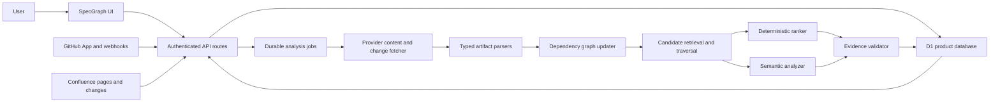

# SpecGraph MVP Implementation Plan

**Status:** Implementation — Package 1 complete  
**Last updated:** August 15, 2026  
**Primary reference:** [SpecGraph Resume Project Assessment](./RESUME_PROJECT_ASSESSMENT.md)

## How to Use This Plan

- Check off a task only when its stated behavior is implemented and tested.
- Update the milestone status table at the start and end of each work session.
- Do not mark a milestone complete until every exit criterion passes.
- Add newly discovered work to the relevant milestone instead of expanding the active milestone silently.
- Record material architecture changes in the decision log at the bottom of this file.

Status legend:

- `[ ]` Not started
- `[x]` Complete
- `IN PROGRESS` should appear beside the one milestone currently being implemented
- `BLOCKED` should include the blocker and required decision

---

## 1. Product Goal

SpecGraph should be explainable in one sentence:

> When code or a specification changes, SpecGraph identifies which tests, documentation, APIs, and related artifacts may require updates and explains the supporting evidence.

The MVP is successful when it can take a real GitHub change through this complete path:

```text
GitHub push, pull request, Confluence page change, or manual analysis
        ↓
Fetch and parse changed artifacts
        ↓
Update a typed dependency graph
        ↓
Find and rank potentially affected artifacts
        ↓
Attach verified evidence and exact source links
        ↓
Persist the run and findings
        ↓
Display the result in the existing SpecGraph feed
```

The UI is already sufficient to support this flow. The immediate priority is product behavior, persistence, analysis quality, and operational credibility—not additional dashboard features.

---

## 2. MVP Scope

### Included in the first functional MVP

- One authenticated SpecGraph workspace.
- One or a small number of connected GitHub repositories.
- GitHub App installation and repository selection.
- Automatic discovery of Markdown, MDX, README, and OpenAPI documentation inside connected repositories.
- A guided documentation-source step that can connect one Confluence site and space or be skipped until later.
- Read-only Confluence page and version ingestion.
- Manual analysis of a branch, pull request, commit range, or supported file.
- Automatic analysis from GitHub pushes, pull requests, and supported Confluence page changes.
- Repository ingestion for:
  - TypeScript and JavaScript source files.
  - TypeScript and JavaScript test files.
  - Markdown and MDX documentation.
  - OpenAPI YAML, YML, and JSON documents.
- A typed dependency graph stored in the existing relational platform database.
- Deterministic relationships derived from imports, identifiers, links, schemas, endpoints, and tests.
- Semantic analysis for ambiguous relationships after deterministic candidate retrieval.
- Persistent runs, findings, evidence, source links, and review actions.
- Open, dismissed, and resolved finding states.
- Exact links to the relevant GitHub revision whenever possible.
- Polling for run progress; real-time sockets are not required.
- Unit, integration, end-to-end, and analysis-evaluation coverage.
- A stable recruiter-accessible deployment and project-specific README.

### Explicitly deferred

- Automatic file edits or pull-request creation.
- A broad connector marketplace.
- External documentation connectors beyond Confluence.
- Slack, email, or Teams notifications.
- A visual node-link graph editor.
- Full-repository semantic search.
- Real-time WebSocket updates.
- Complex roles, billing, or enterprise administration.
- Organization-wide repository discovery.
- Support for every programming language.

### Default product decisions

These defaults prevent the project from stalling. Change them only through the decision log.

| Area | Default decision | Reason |
| --- | --- | --- |
| First code source | GitHub App | Provides scoped access, webhooks, installation identity, and a credible production integration. |
| Repository documentation | Discover Markdown, MDX, README, and OpenAPI automatically | Users should not reconnect documentation that already lives beside their code. |
| First external documentation source | Confluence | Makes the cross-source product promise real without introducing a broad connector catalog. |
| Graph storage | D1 relational tables | Sufficient for the MVP graph size and keeps deployment simple; no graph database is required. |
| Artifact snapshots | Git commit SHA and provider revision links | GitHub already retains immutable revisions; add blob storage only when external documents require it. |
| Analysis strategy | Deterministic graph first, semantic model second | Improves explainability, precision, and cost control. |
| Run updates | Client polling | Simple and adequate for MVP-scale jobs. |
| Product action | Detect and explain only | Keeps the first release safe and measurable. |
| Initial tenancy | Private, identity-aware workspace | Uses the platform's authenticated-user identity and avoids building a separate auth system. |
| Deployment direction | Migrate away from OpenAI Sites before the final release; replacement host is not yet selected | The repository and runtime should be independently deployable and controlled outside the temporary Sites environment. |

### Minimal source-connection experience

The product should expose source setup progressively rather than presenting an integration dashboard. GitHub-first is the recommended path, but source connection must work in either order.

1. **Add a source:** the single page-level **Add source** action opens a small dialog with **GitHub repository** and **Confluence documentation**.
2. **Authorize and choose:** selecting GitHub begins GitHub authorization and repository/branch selection; selecting Confluence begins Confluence authorization and site/space/page selection.
3. **Complete the relationship:** a repository row exposes **Add documentation**; an unattached documentation row exposes **Connect repository**. These contextual actions reuse the same dialog with the relevant provider preselected. Repository documentation is included automatically.
4. **Check connections:** show a simple preparing, connected, or needs-attention state.
5. **Use one feed:** changes from GitHub and Confluence enter the same Changes experience.

The Sources hierarchy must make ownership explicit rather than displaying providers as unrelated rows:

```text
StreetFighter-AI · main
├── Repository documentation — 1 indexed file
└── Confluence — Engineering / StreetFighter
```

Before external documentation is connected, the final child is an **Add documentation** action. It belongs to that repository row so the resulting Confluence site/space is durably associated with the intended codebase. A workspace with multiple repositories must never leave the external documentation mapping implicit.

Documentation-first setup creates an unattached documentation source until the user chooses its repository. Before creating either a provider source or a repository-documentation association, SpecGraph must compare canonical provider identities. Reconnecting the same Confluence scope, GitHub repository, or exact repository-documentation pair is an idempotent no-op. The UI should say **Already tracked with StreetFighter-AI** and reveal the existing group instead of creating duplicate artifacts, relationships, runs, or findings.

The page-level action must never say Connect GitHub once the provider dialog exists. The Add source dialog shows only usable MVP provider choices, explains each in one short line, and closes when authorization begins. It is a chooser, not an integrations dashboard.

The UI should never require users to understand ingestion, graph construction, webhooks, synchronization cursors, or analysis providers.

---

## 3. Current Baseline

### Already complete

- [x] Minimal black-and-white changes feed.
- [x] Open and All filtering.
- [x] Change details with progressively disclosed evidence.
- [x] Runs and Sources views.
- [x] Manual Analyze interaction prototype.
- [x] Responsive and accessible interaction states.
- [x] Component tests for the main UI behaviors.
- [x] Rendered HTML tests.
- [x] Cloudflare/vinext build and deployment scaffolding.
- [x] Drizzle and D1 scaffolding.
- [x] Optional authenticated-user helpers.
- [x] Persistent database schema and initial migration.
- [x] Authenticated personal workspace resolution.
- [x] Product read APIs and persisted finding actions.
- [x] Production UI backed by the API contract rather than fixtures.

### Still mocked or absent

- [ ] GitHub installation and repository connection.
- [ ] Source ingestion and incremental synchronization.
- [ ] Artifact parsers.
- [ ] Typed dependency graph.
- [ ] Manual background analysis.
- [ ] Signed GitHub webhooks.
- [ ] Idempotency, retry, and failure recovery.
- [ ] Semantic candidate analysis.
- [ ] Evidence verification.
- [ ] Evaluation dataset and quality metrics.
- [ ] Product-specific README and public demonstration repository.

---

## 4. Target Architecture



### Architectural boundaries

1. **UI:** Displays state and submits commands; it does not fabricate domain records.
2. **API:** Authenticates, validates input, scopes queries, and persists commands.
3. **Provider adapters:** Encapsulate GitHub and Confluence authentication, API calls, change events, and canonical URLs.
4. **Ingestion:** Converts provider content into normalized artifacts and versions.
5. **Graph engine:** Creates typed relationships and traverses affected neighborhoods.
6. **Analysis engine:** Ranks candidate impacts and produces structured explanations.
7. **Evidence validator:** Verifies every stored excerpt against the fetched source revision.
8. **Job runner:** Owns status transitions, retries, timeouts, and failure recovery.
9. **Repositories:** Centralize database queries and tenant ownership checks.

### Suggested source layout

The exact names may evolve, but these responsibilities should remain separated:

```text
app/
  api/
    changes/
    runs/
    sources/
    webhooks/github/
    webhooks/confluence/
db/
  schema.ts
  repositories/
lib/
  auth/
  domain/
  github/
  confluence/
  ingestion/
  parsers/
  graph/
  analysis/
  jobs/
  evaluation/
tests/
  fixtures/
  integration/
  evaluation/
```

---

## 5. Domain and Data Model

The feed should be derived from analysis runs and findings. Do not introduce a separate feed table that duplicates product state.

| Entity | Purpose | Important fields |
| --- | --- | --- |
| `workspaces` | Tenant boundary for all product data | `id`, `name`, `createdAt` |
| `users` | Stable authenticated users | `id`, `providerUserId`, `email`, `displayName` |
| `workspace_members` | User-to-workspace authorization | `workspaceId`, `userId`, `role` |
| `sources` | Connected provider repositories or document spaces | `id`, `workspaceId`, `provider`, `externalId`, `name`, `defaultBranch`, `status`, `lastSyncedAt` |
| `artifacts` | Provider-backed files or pages and their provenance | `id`, `sourceId`, `externalId`, `kind`, `path`, `title`, `canonicalUrl`, `currentRevision`, `contentHash` |
| `artifact_versions` | Revision metadata and extracted content needed for comparison | `id`, `artifactId`, `revision`, `contentHash`, `extractedText`, `createdAt` |
| `graph_nodes` | Typed addressable units inside artifacts | `id`, `artifactId`, `stableKey`, `kind`, `name`, `startLine`, `endLine`, `contentHash` |
| `relationships` | Directed typed graph edges between nodes | `fromNodeId`, `toNodeId`, `type`, `origin`, `confidence`, `evidence` |
| `change_events` | Normalized push, pull request, or manual change input | `id`, `sourceId`, `trigger`, `beforeRevision`, `afterRevision`, `actor`, `occurredAt` |
| `analysis_runs` | Durable unit of background work | `id`, `workspaceId`, `sourceId`, `changeEventId`, `target`, `status`, `progress`, `attempts`, `errorCode`, timestamps |
| `run_attempts` | Retry and stage-level execution history | `id`, `runId`, `attempt`, `stage`, `status`, `errorCode`, `startedAt`, `finishedAt` |
| `findings` | A changed node's potential impact on another node | `id`, `runId`, `changedNodeId`, `affectedNodeId`, `summary`, `confidence`, `origin`, `status`, `deduplicationKey` |
| `finding_evidence` | One or more verifiable excerpts supporting a finding | `id`, `findingId`, `artifactVersionId`, `startLine`, `endLine`, `excerpt`, `sourceUrl`, `type` |
| `finding_actions` | Review history and audit trail | `id`, `findingId`, `userId`, `action`, `note`, `createdAt` |
| `webhook_deliveries` | Signature verification and idempotency record | `providerDeliveryId`, `eventType`, `payloadHash`, `status`, `receivedAt`, `processedAt` |
| `evaluation_cases` | Labeled expected impacts | `id`, `repository`, `beforeRevision`, `afterRevision`, `expectedArtifactIds` |
| `evaluation_results` | Reproducible quality measurements | `caseId`, `analyzerVersion`, `predictedArtifactIds`, `latencyMs`, `createdAt` |

### Required constraints and indexes

- [ ] Every product table is scoped directly or indirectly to a workspace.
- [ ] Provider source IDs are unique within a workspace.
- [ ] Artifact external IDs are unique within a source.
- [ ] Artifact versions are unique by artifact and revision.
- [ ] Graph node stable keys are unique within an artifact.
- [ ] Relationships are unique by source node, target node, type, and origin.
- [ ] Provider webhook delivery IDs are unique.
- [ ] Open findings are indexed by workspace, status, and creation time.
- [ ] Runs are indexed by workspace, status, and creation time.
- [ ] All delete behavior is explicitly defined; no accidental orphaned evidence.

### State models

```text
Source:  pending → syncing → connected
                     ↘ error → syncing
                     ↘ disconnected

Run:     queued → running → succeeded
                    ↘ failed → queued (retry)

Finding: open → resolved
              ↘ dismissed
        resolved/dismissed → open (reopen)
```

---

## 6. API Contract

All write routes must authenticate the user, resolve their workspace server-side, validate input, and reject cross-workspace identifiers.

| Method and route | Purpose | MVP response behavior |
| --- | --- | --- |
| `GET /api/changes?status=open|all` | Load the feed | Paginated findings grouped by change/run with affected counts and status |
| `GET /api/changes/:id` | Load finding details | Changed artifact, affected artifacts, evidence, and exact source URLs |
| `PATCH /api/changes/:id` | Dismiss, resolve, or reopen | Persist action and return updated state |
| `GET /api/runs` | Load recent activity | Paginated manual and automatic runs |
| `POST /api/runs` | Start manual analysis | Validate source and target, persist a queued run, return its ID |
| `GET /api/runs/:id` | Poll run status | Status, progress, findings count, and safe failure message |
| `GET /api/sources` | Load connected sources | Real connection and synchronization state |
| `POST /api/sources/github/install` | Begin GitHub installation | Return or redirect to the GitHub App installation flow |
| `GET /api/sources/github/callback` | Complete installation | Validate state, persist installation metadata, begin initial sync |
| `POST /api/sources/confluence/connect` | Begin Confluence connection | Return or redirect to the read-only Confluence authorization flow |
| `GET /api/sources/confluence/callback` | Complete Confluence connection | Validate state, select a site/space, and begin initial page sync |
| `DELETE /api/sources/:id` | Disconnect a source | Revoke or detach access and retain/delete data according to policy |
| `POST /api/webhooks/github` | Receive GitHub events | Verify signature, deduplicate delivery, persist event, enqueue run |
| `POST /api/webhooks/confluence` | Receive or normalize Confluence changes | Verify the event when supported, deduplicate it, and enqueue the same analysis pipeline |

### Contract rules

- [ ] Dates are absolute timestamps in APIs; relative labels are calculated by the UI.
- [ ] IDs are durable server-generated values, never `Date.now()` client IDs.
- [ ] Every artifact response includes a provider URL when one exists.
- [ ] Processing states come only from persisted run status.
- [ ] Errors use stable codes plus user-safe messages.
- [ ] List routes use deterministic ordering and cursor pagination.
- [ ] Provider-specific shapes stay inside provider adapters.

---

## 7. Analysis Pipeline

### Ingestion and normalization

1. Resolve the exact connected source and revisions for the run target.
2. Fetch only relevant changed files or pages plus the artifacts needed for indexing.
3. Classify supported files by artifact kind.
4. Normalize content into file-, section-, symbol-, endpoint-, schema-, and test-level records.
5. Hash normalized content to skip unchanged artifacts.
6. Upsert artifact versions and remove or tombstone deleted artifacts.
7. Rebuild only relationships affected by the changed artifacts.

### Deterministic relationship extraction

- [ ] TypeScript/JavaScript imports and exports.
- [ ] Direct symbol references where safely resolvable.
- [ ] Test-to-source relationships from imports and naming conventions.
- [ ] Markdown links and referenced file paths.
- [ ] OpenAPI path, operation, request, response, and schema references.
- [ ] Identical endpoint names, schema names, constants, and documented identifiers.
- [ ] Explicit code comments or documentation references to another artifact.

Every deterministic edge stores its type and the exact evidence used to create it.

### Candidate retrieval

1. Map changed lines or diff hunks to normalized graph nodes.
2. Traverse typed edges within a configured maximum depth.
3. Add exact identifier, path, schema, and endpoint matches.
4. Deduplicate candidates.
5. Apply cheap deterministic ranking before any model call.
6. Send only ambiguous, bounded candidates to semantic analysis.

### Impact ranking

Initial ranking inputs:

- Relationship type and whether it is deterministic or model-derived.
- Graph distance from the changed artifact.
- Changed-line overlap with the linked symbol or section.
- Exact identifier or endpoint matches.
- Artifact kind and expected dependency direction.
- Semantic confidence.
- Whether multiple independent signals support the same finding.

### Semantic analysis guardrails

- [ ] Use a strict structured-output schema.
- [ ] Provide changed text, candidate text, relationship context, and revision metadata.
- [ ] Require an impact decision, concise explanation, and exact supporting excerpts.
- [ ] Verify every returned excerpt against source text before persistence.
- [ ] Reject unsupported evidence instead of displaying it.
- [ ] Mark model-derived relationships separately from deterministic relationships.
- [ ] Fall back to deterministic results when the model is unavailable.
- [ ] Record model, prompt/analyzer version, latency, token usage, and estimated cost.

---

## 8. Milestone Roadmap

### Milestone status

| Milestone | Status | Depends on | Primary outcome |
| --- | --- | --- | --- |
| M0 — Contract and test seam | In progress | Current prototype | UI no longer owns product fixtures or domain behavior |
| M1 — Persistence and identity | In progress | M0 | State survives reload and is tenant-scoped |
| M2 — GitHub connection and ingestion | Complete | M1 | One real repository is connected and indexed |
| H1 — Hosting migration | Planned | M2 | The application runs outside Sites with portable auth, persistence, secrets, and callbacks |
| M3 — Deterministic graph | Not started | M2 | Supported artifacts have queryable typed relationships |
| M4 — Manual end-to-end analysis | Not started | M3, H1 | Analyze produces persistent real findings on the durable replacement runtime |
| M5 — Automatic GitHub feed | Not started | M4 | Pushes and pull requests trigger the same pipeline |
| M6 — Confluence documentation connection | Not started | M4, H1 | External documentation participates in the same product flow on the replacement domain |
| M7 — Semantic ranking and evidence | Not started | M4, M6 | Ambiguous cross-source impacts are ranked with verified evidence |
| M8 — Review lifecycle and resilience | Not started | M5, M7 | Actions persist; failures retry safely |
| M9 — Evaluation and production hardening | Not started | M8 | Quality, security, and reliability are measured |
| M10 — Portfolio and resume readiness | Not started | M6, M9 | Recruiters can inspect the complete cross-source product |

### M0 — Contract and Test Seam

Goal: separate the current interface from its mock implementation so real data can replace fixtures without rewriting the UI.

- [x] Move domain types out of `app/page.tsx`.
- [x] Move demo fixtures into test-only or development-only modules.
- [x] Define DTOs for sources, runs, changes, artifacts, and findings.
- [ ] Freeze supported file types, triggers, target shapes, and initial repository-size limits.
- [ ] Create two golden test changes: code-to-doc/test and documentation-to-code/test.
- [ ] Record the expected nodes, edges, and findings for both golden changes.
- [x] Introduce a small data-access boundary used by the UI.
- [x] Replace hardcoded relative times with timestamps plus formatting.
- [x] Define loading, empty, processing, error, and retry states.
- [x] Update component tests to mock API contracts rather than importing production fixtures.
- [ ] Document API and domain naming conventions.

Exit criteria:

- [x] Production UI code contains no hardcoded product records.
- [x] Existing UI behaviors still pass against mocked API responses.
- [x] A failed API request has a clear, minimal user-visible state.
- [ ] Both golden changes have reviewed expected outputs before analyzer work begins.

### M1 — Persistence and Identity

Goal: establish durable, authenticated product state.

- [x] Activate the logical D1 database binding.
- [x] Implement the core Drizzle schema and enums.
- [x] Generate and inspect the initial SQL migration.
- [x] Add repository modules for sources, runs, findings, and actions.
- [x] Resolve stable user identity from authenticated request headers.
- [x] Create or resolve a default workspace for the authenticated user.
- [x] Enforce workspace ownership in every repository query.
- [x] Implement real read APIs for changes, runs, and sources.
- [x] Implement persisted finding state changes.
- [ ] Add a local development seed command that is never used in production.
- [x] Add database and route integration tests.

Exit criteria:

- [x] Feed, Runs, and Sources load from D1.
- [x] A finding action survives page refresh.
- [x] One user cannot access another workspace's IDs in integration tests.
- [ ] Migrations work against a fresh database and an existing local database.

### M2 — GitHub Connection and Ingestion

Goal: connect and index one real repository securely.

- [x] Create and configure a GitHub App with minimum required permissions.
- [x] Implement installation state validation and callback handling.
- [x] Persist installation and selected repository metadata without storing long-lived tokens in plaintext.
- [x] Add a repository picker limited to the installation's accessible repositories.
- [x] Implement a `SourceProvider` interface.
- [x] Implement the GitHub provider adapter.
- [x] Fetch repository metadata and the default branch.
- [x] Enumerate supported files without downloading ignored or oversized content.
- [x] Store normalized artifact metadata, revision, hash, and canonical URL.
- [x] Report initial-sync progress and failures truthfully in Sources.
- [x] Add recorded provider fixtures and adapter contract tests.
- [x] Add disconnect behavior and document its data-retention policy.

Exit criteria:

- [x] A real GitHub repository can be connected through the UI.
- [x] Supported files appear as persisted artifacts in the integration harness.
- [x] Every indexed artifact has a revision and immutable source URL in the integration harness.
- [x] Re-running ingestion skips unchanged content.

### H1 — Hosting Migration

Goal: move SpecGraph away from OpenAI Sites without losing the working product or binding the architecture prematurely to another vendor.

Sites remains the temporary live environment until the replacement deployment passes the full smoke test. Do not remove `.openai/hosting.json`, delete the Sites project, or cut over callback URLs before that gate passes.

- [ ] Inventory Sites-specific dependencies: vinext/Worker output, authenticated-user headers, D1 bindings, runtime environment access, deployment packaging, and the current domain.
- [ ] Select the replacement hosting, relational database, authentication, background-job, and secret-management stack as one compatible system.
- [ ] Keep product repositories and provider adapters independent from the hosting runtime through small auth, database, queue, and environment boundaries.
- [ ] Decide whether to migrate D1 data into the replacement database or intentionally start the pre-release environment from an empty schema.
- [ ] Run all migrations from an empty replacement database and verify tenant isolation and source-removal retention behavior.
- [ ] Configure GitHub App credentials and update its homepage, OAuth callback, setup, and later webhook URLs for the replacement domain.
- [ ] Configure Confluence OAuth callbacks against the replacement domain before production Confluence authorization begins.
- [ ] Provide a durable job mechanism that does not depend on an HTTP request remaining alive.
- [ ] Recreate production secrets outside source control and confirm no provider token or private key is exposed to the browser or logs.
- [ ] Deploy a staging environment from the GitHub repository and run the complete repository connection, sync, analysis, persistence, and removal smoke test.
- [ ] Cut over the stable URL only after the replacement deployment passes; keep the Sites deployment available for rollback during the verification window.
- [ ] Retire the Sites deployment and remove Sites-only configuration only after callbacks, data, authentication, and observability are confirmed on the replacement.

Exit criteria:

- [ ] A clean GitHub checkout can deploy without OpenAI Sites tooling.
- [ ] Authentication and workspace identity remain stable and server-enforced.
- [ ] Structured data persists across deploys and migrations on the replacement database.
- [ ] GitHub and Confluence callbacks use the replacement domain.
- [ ] Background jobs, retries, and logs work without request-lifetime coupling.
- [ ] The end-to-end smoke test passes before Sites is decommissioned.

### M3 — Deterministic Dependency Graph

Goal: produce useful, explainable graph edges without relying on an LLM.

- [ ] Implement a common parser output contract.
- [ ] Implement TypeScript/JavaScript file and import parsing.
- [ ] Implement test-file classification and test-to-source linking.
- [ ] Implement Markdown/MDX heading, link, and identifier parsing.
- [ ] Implement OpenAPI operation, schema, and `$ref` parsing.
- [ ] Map parsed objects to stable artifact or sub-artifact identifiers.
- [ ] Upsert deterministic relationships with evidence.
- [ ] Remove stale relationships after artifact changes or deletion.
- [ ] Implement bounded graph traversal.
- [ ] Implement deterministic candidate scoring.
- [ ] Add focused parser, graph, incremental-update, and ranking tests.

Exit criteria:

- [ ] A fixture repository produces the expected nodes and edges deterministically.
- [ ] A changed OpenAPI schema can locate linked documentation and tests.
- [ ] A changed Markdown statement can locate linked code, schema, or tests when explicit relationships exist.
- [ ] Incremental indexing updates only affected graph regions.

### M4 — Manual End-to-End Analysis

Goal: make the existing Analyze action perform genuine backend work.

- [ ] Validate manual targets as branch, pull request, revision range, supported path, or provider document/page.
- [ ] Persist a queued run before starting work.
- [ ] Implement job claiming and safe status transitions.
- [ ] Fetch the exact before and after revisions.
- [ ] Create a normalized change event.
- [ ] Map diff hunks to changed graph nodes.
- [ ] Retrieve and rank deterministic candidate impacts.
- [ ] Persist findings, evidence, and source links.
- [ ] Poll run status from the UI.
- [ ] Replace the mock processing row with persisted state.
- [ ] Load completed findings into the existing feed.
- [ ] Show useful failure and retry states.
- [ ] Add an integration test from submitted run through persisted finding.

Exit criteria — the walking skeleton:

- [ ] Connect a real repository.
- [ ] Submit a real pull request, branch, or commit range.
- [ ] Observe queued and running states.
- [ ] Receive at least one deterministic finding when the fixture change warrants it.
- [ ] Open the affected artifact at the exact GitHub revision.
- [ ] Refresh the app without losing the run or finding.

### M5 — Automatic GitHub Feed

Goal: create feed items automatically when relevant code or documentation changes.

- [ ] Add the GitHub webhook endpoint.
- [ ] Verify every webhook signature before processing.
- [ ] Persist delivery metadata before acknowledging the event.
- [ ] Deduplicate repeated provider delivery IDs.
- [ ] Normalize supported push events.
- [ ] Normalize supported pull-request events.
- [ ] Ignore unsupported events explicitly and observably.
- [ ] Enqueue automatic runs through the same service used by manual runs.
- [ ] Preserve actor, repository, branch, PR, and revision context.
- [ ] Add webhook signature, replay, idempotency, and event-shape tests.

Exit criteria:

- [ ] A real push or pull-request update creates one and only one run.
- [ ] The run appears in Runs without a page refresh after the next poll.
- [ ] Completed findings appear in the same feed as manual findings.
- [ ] Code-first and repository-documentation-first changes use the same pipeline.

### M6 — Confluence Documentation Connection

Goal: let users connect external documentation without making source setup feel technical or complex.

- [ ] Replace the page-level Connect GitHub/Add repository action with one Add source action.
- [ ] Open an accessible provider dialog containing GitHub repository and Confluence documentation choices.
- [ ] Route GitHub selection into GitHub authorization and repository/branch selection.
- [ ] Route Confluence selection into Confluence authorization and site/space/page selection.
- [ ] Reuse the same provider dialog for Add documentation and Connect repository, pre-scoped to the relevant missing source type.
- [ ] Add the onboarding question: Where are your docs?
- [ ] Explain that documentation inside GitHub is already included.
- [ ] Offer Connect Confluence and Not now as the only additional choices.
- [ ] Show Add documentation within every connected repository row, including after onboarding has been skipped or completed.
- [ ] Persist an explicit repository-to-documentation-source association; never infer the target repository from connection order.
- [ ] Group attached Confluence site/space information beneath its repository instead of showing it as an unrelated top-level source.
- [ ] Support documentation-first setup by showing an unattached Confluence source with a Connect repository action.
- [ ] Canonicalize GitHub repository and Confluence site/space/page identities before writes.
- [ ] Enforce uniqueness for provider sources and the `(workspace, repository source, documentation source)` association in D1.
- [ ] Make repeated connection callbacks and association requests idempotent under retries and concurrent submissions.
- [ ] When the exact pair already exists, show Already tracked with the existing repository name and focus that source group.
- [ ] Implement read-only Confluence authorization and state validation.
- [ ] Let the user select one accessible site and space.
- [ ] Persist Confluence source metadata without exposing credentials to the browser.
- [ ] Ingest page IDs, versions, titles, sections, links, and canonical URLs.
- [ ] Normalize Confluence pages through the same artifact and graph-node contracts used for repository documentation.
- [ ] Store durable external page snapshots when immutable provider retrieval is insufficient.
- [ ] Create relationships between Confluence sections and GitHub code, tests, and OpenAPI nodes.
- [ ] Receive or poll for incremental page changes and deduplicate them.
- [ ] Send Confluence changes through the same run and finding pipeline.
- [ ] Display GitHub and Confluence as simple connected sources with truthful health states.
- [ ] Show a source choice in Analyze only when more than one connected source makes it necessary.
- [ ] Add Confluence provider-contract, authorization, sync, and change-event tests.

Exit criteria:

- [ ] Add source is the only generic page-level connection action and both provider choices start the correct authorization flow.
- [ ] Repository documentation is included automatically after GitHub connection.
- [ ] A user can connect one Confluence space through the Sources experience.
- [ ] A user can add or replace related documentation from an already-connected repository row.
- [ ] With multiple repositories connected, each external documentation source is visibly and durably mapped to exactly the intended repository.
- [ ] Connecting Confluence first and GitHub second produces the same source group as GitHub-first setup.
- [ ] Repeating either order does not duplicate sources, associations, artifacts, relationships, runs, or findings.
- [ ] An attempted duplicate clearly identifies the existing tracked repository-documentation group.
- [ ] A Confluence page edit can create findings against linked code, schemas, or tests.
- [ ] A code change can identify an affected Confluence page.
- [ ] Every cross-source finding opens the correct GitHub revision or Confluence page/version.
- [ ] Users who select Not now can use the GitHub-only workflow without warnings or fake source rows.

### M7 — Semantic Ranking and Verified Evidence

Goal: find meaningful relationships that explicit parsing cannot capture without sacrificing trust.

- [ ] Freeze the structured semantic-analysis input and output schemas.
- [ ] Introduce bounded semantic candidate generation.
- [ ] Add the model call behind an analyzer interface.
- [ ] Version prompts and analyzer configuration.
- [ ] Distinguish deterministic, semantic, and hybrid findings.
- [ ] Verify returned evidence against exact source revisions.
- [ ] Reject or downgrade unsupported model output.
- [ ] Combine graph distance, edge origin, and semantic score into final ranking.
- [ ] Establish confidence thresholds for display and suppression.
- [ ] Record latency, usage, estimated cost, and failure reason.
- [ ] Add deterministic fallback behavior.
- [ ] Add adversarial fixtures for hallucinated evidence and irrelevant matches.

Exit criteria:

- [ ] No displayed semantic finding lacks verified source evidence.
- [ ] Semantic analysis improves recall on the labeled set without unacceptable precision loss.
- [ ] A model outage still returns deterministic findings and a truthful run status.

### M8 — Review Lifecycle and Operational Resilience

Goal: make the product usable over repeated runs and credible under failure.

- [ ] Persist dismiss, resolve, and reopen actions.
- [ ] Record the actor and timestamp for every action.
- [ ] Make Open and All filters query real persisted states.
- [ ] Decide how a previously dismissed relationship behaves after a materially new change.
- [ ] Add durable retry policies with capped attempts and backoff.
- [ ] Prevent two workers from completing the same run concurrently.
- [ ] Add timeout and cancellation handling.
- [ ] Surface safe failure details and an explicit retry action.
- [ ] Record terminal failures for investigation.
- [ ] Add structured logs with run, source, workspace, and provider-delivery correlation IDs.
- [ ] Display real source synchronization health and last-checked time.

Exit criteria:

- [ ] Review actions survive reload and future sessions.
- [ ] Duplicate jobs and webhooks do not duplicate findings.
- [ ] Transient failures retry and recover in an integration test.
- [ ] Permanent failures are visible without exposing secrets.

### M9 — Evaluation and Production Hardening

Goal: measure analysis quality and demonstrate secure, production-style engineering.

- [ ] Create a labeled evaluation set of at least 25 representative changes.
- [ ] Include code-first, documentation-first, OpenAPI, test, unrelated, and ambiguous changes.
- [ ] Record expected affected artifacts for every case.
- [ ] Build a repeatable evaluation command.
- [ ] Report precision, recall, F1, false-positive rate, evidence coverage, and latency.
- [ ] Compare deterministic-only and hybrid analyzer results.
- [ ] Add regression thresholds that fail when quality drops materially.
- [ ] Add repository size and incremental-index timing measurements.
- [ ] Enforce request and webhook rate limits.
- [ ] Audit tenant isolation and repository authorization.
- [ ] Audit secret and token handling.
- [ ] Add retention and deletion behavior.
- [ ] Add health, error-rate, retry-rate, latency, and cost telemetry.
- [ ] Document known failure modes and limitations.

Initial quality targets, to be validated rather than claimed:

| Metric | Initial target |
| --- | --- |
| Evidence coverage | 100% of displayed findings |
| Precision | At least 80% on the labeled set |
| Recall | At least 70% on the labeled set |
| Duplicate findings after webhook replay | 0 |
| Successful recovery from tested transient failures | 100% |
| Median incremental analysis latency | Under 60 seconds for the demo repository |

Exit criteria:

- [ ] Evaluation results are reproducible from a clean checkout.
- [ ] Quality and latency metrics come from recorded runs, not estimates.
- [ ] Security and failure-recovery checklist is complete.
- [ ] Known limitations are documented honestly.

### M10 — Portfolio and Resume Readiness

Goal: make the implementation independently verifiable by recruiters and interviewers.

- [ ] Replace the starter README with a SpecGraph README.
- [ ] Include the one-sentence problem statement and product demo.
- [ ] Document architecture, data flow, graph model, and analysis tradeoffs.
- [ ] Document local setup, test, evaluation, and deployment procedures.
- [ ] Document the replacement hosting architecture and the completed Sites migration.
- [ ] Include screenshots or a short demo recording.
- [ ] Publish measured evaluation and latency results.
- [ ] Document security choices and known limitations.
- [ ] Provide a safe demo repository with representative changes.
- [ ] Make the application public or recruiter-accessible.
- [ ] Make the source repository public or provide a verifiable review path.
- [ ] Gather feedback from at least three external testers if feasible.
- [ ] Write resume bullets only after replacing every placeholder with measured results.

Resume-ready gate:

- [ ] A reviewer can connect or inspect a real repository and external documentation flow.
- [ ] A real manual or webhook-triggered run produces persistent findings.
- [ ] Code-first and Confluence-first changes both produce findings in the same feed.
- [ ] The graph and ranking implementation can be explained from source code.
- [ ] Findings contain exact evidence and revision links.
- [ ] Automated tests cover the pipeline, not only the UI.
- [ ] Evaluation quality and latency are published.
- [ ] The deployment and repository are stable and independently inspectable.

---

## 9. Testing Strategy

### Unit tests

- Parsers for each supported artifact format.
- Diff-to-node mapping.
- Relationship extraction and stale-edge removal.
- Graph traversal, ranking, and confidence thresholds.
- Evidence excerpt verification.
- Status transition rules.
- Authorization and input validation helpers.
- Webhook signature verification and delivery deduplication.

### Integration tests

- Fresh migration and database upgrade path.
- Workspace-scoped repository queries.
- Connect source and initial ingestion using recorded GitHub fixtures.
- Connect Confluence and ingest repository-linked documentation using recorded provider fixtures.
- Manual run through persisted findings.
- Webhook receipt through queued analysis.
- Retry and terminal failure behavior.
- Dismiss, resolve, and reopen persistence.
- Provider rate-limit and expired-credential handling.

### End-to-end tests

1. Sign in and connect a repository.
2. Confirm repository documentation is included automatically.
3. Connect a Confluence space.
4. Run a manual analysis against a known pull request.
5. Observe processing and completed states.
6. Open GitHub and Confluence findings and follow their source links.
7. Dismiss a finding and verify persistence after reload.
8. Replay a provider event and verify no duplicate run or finding appears.

### Evaluation tests

- Use versioned, labeled change cases rather than subjective screenshots.
- Keep expected affected artifacts separate from analyzer output.
- Run deterministic-only and hybrid variants against the same dataset.
- Preserve analyzer and prompt versions with each result.
- Review false positives and false negatives before changing thresholds.

---

## 10. Security and Reliability Checklist

- [ ] Use least-privilege GitHub App permissions.
- [ ] Verify GitHub signatures with constant-time comparison.
- [ ] Validate installation state and callback parameters.
- [ ] Never expose provider tokens to the browser.
- [ ] Never log credentials, raw authorization headers, or webhook secrets.
- [ ] Scope every database operation by workspace.
- [ ] Validate that requested repository resources belong to the connected installation.
- [ ] Limit fetched file size, file count, and supported extensions.
- [ ] Defend against path traversal and unsafe archive extraction.
- [ ] Rate-limit manual runs and webhook endpoints.
- [ ] Deduplicate webhook deliveries and run claims.
- [ ] Cap graph traversal depth and semantic candidate count.
- [ ] Add timeouts, retries, and terminal failure handling.
- [ ] Treat source text and repository instructions as untrusted data.
- [ ] Require verified evidence before displaying model-derived claims.
- [ ] Define repository disconnect, deletion, and retention behavior.

---

## 11. Metrics and Observability

### Product metrics

- Repositories connected.
- Pull requests, pushes, and manual targets analyzed.
- Findings created, opened, resolved, dismissed, and reopened.
- Acceptance or dismissal rate by finding origin.
- Percentage of runs producing useful findings.

### Graph and ingestion metrics

- Files and artifact nodes indexed.
- Relationships by type and origin.
- Initial ingestion time.
- Incremental update time.
- Files skipped by reason.

### Analysis metrics

- End-to-end and stage-level latency.
- Candidate count before and after deterministic ranking.
- Precision, recall, F1, and false-positive rate.
- Evidence validation pass rate.
- Model usage, estimated cost, and failure rate.
- Deterministic-only versus hybrid quality.

### Reliability metrics

- Webhook delivery count and duplicate rate.
- Run success, retry, and terminal failure rates.
- Queue age and job duration.
- Provider rate-limit and authentication failures.
- Recovery time for tested transient failures.

---

## 12. Risk Register

| Risk | Impact | Mitigation |
| --- | --- | --- |
| Parser scope grows across languages | Delays the end-to-end MVP | Limit the first release to TypeScript/JavaScript, Markdown/MDX, OpenAPI, and tests. |
| Semantic analysis produces unsupported claims | Destroys user trust | Retrieve bounded candidates, require exact evidence, verify excerpts, and reject unsupported output. |
| Too many weak graph edges create noisy findings | Low precision and poor demos | Separate deterministic and semantic edges, cap traversal, tune on a labeled dataset, and suppress below threshold. |
| Background work is not durable | Stuck processing states or lost analyses | Persist jobs before execution and move to a durable queue/runner before beta. |
| GitHub token or permission mistakes | Security and reviewer concerns | Use a least-privilege GitHub App, keep tokens server-side, and test authorization boundaries. |
| Webhook retries duplicate results | Confusing feed and bad metrics | Deduplicate delivery IDs and enforce uniqueness on runs/findings. |
| Large repositories exceed runtime limits | Failed syncs and slow demos | Apply file limits, ignore rules, incremental hashing, bounded candidate retrieval, and clear supported-size limits. |
| External documentation integration stalls the core pipeline | The product never reaches a working end-to-end state | Build the GitHub walking skeleton first, then add Confluence as the required M6 source adapter before resume readiness. |
| UI polishing consumes backend time | Project remains a prototype | Freeze the current visual system until the walking skeleton passes. |
| Resume bullets get ahead of implementation | Credibility risk | Use only measured results from M9 and implemented capabilities from M10. |

---

## 13. Delivery Gates

### Gate A — Persistent application

- [ ] Real authenticated data replaces production fixtures.
- [ ] Changes, runs, and source state survive reload.
- [ ] Finding actions persist.

### Gate B — Functional GitHub MVP

- [ ] One real repository connects and indexes successfully.
- [ ] Manual analysis produces graph-derived findings.
- [ ] Exact evidence and revision links are displayed.

### Gate C — Automatic private beta

- [ ] Signed push and pull-request webhooks trigger durable runs.
- [ ] Duplicate deliveries are harmless.
- [ ] Failures retry and surface truthful status.

### Gate D — Resume-ready flagship project

- [ ] GitHub repository documentation is included automatically.
- [ ] A user can connect an external Confluence documentation source.
- [ ] Code-first and external-documentation-first changes both produce linked findings.
- [ ] Hybrid analysis is evaluated on a labeled dataset.
- [ ] Quality, latency, and reliability metrics are published.
- [ ] The deployment and source are independently inspectable.
- [ ] The README explains architecture, tradeoffs, security, and limitations.

---

## 14. Rough Delivery Estimate

These are planning ranges, not commitments. They assume focused implementation and one primary developer.

| Outcome | Estimated focused engineering time |
| --- | --- |
| Persistent UI and API foundation | 1–3 days |
| GitHub connection and initial ingestion | 2–4 days |
| Deterministic graph and manual walking skeleton | 4–7 days |
| Automatic webhooks and operational resilience | 2–4 days |
| Semantic analysis and evaluation harness | 3–6 days |
| Confluence connection and cross-source synchronization | 3–5 days |
| Portfolio documentation and demo preparation | 1–3 days |
| GitHub-only functional milestone | Approximately 10–15 focused days |
| Complete GitHub and Confluence resume-ready version | Approximately 18–27 focused days |

---

## 15. Immediate Next Work Package

Do not begin with the model or Confluence adapter. The next implementation package should establish the provider-neutral seam that both GitHub and external documentation will use.

### Package 1 — Contracts, D1, and real reads

- [x] Freeze the domain DTOs.
- [x] Move mock records out of production UI code.
- [x] Implement the initial schema and migration.
- [x] Add authenticated workspace resolution.
- [x] Add source, run, finding, and action repositories.
- [x] Add read APIs and finding-state mutation.
- [x] Rewire the existing UI to those APIs.
- [x] Preserve component tests with API mocks.
- [x] Add database and route integration tests.

Package 1 is complete when the current UI behaves the same way using persisted server data and retains every state change after a reload.

### Package 2 — GitHub walking skeleton

**Status:** In progress — implementation and simulated end-to-end coverage complete; GitHub App credentials and a real repository smoke test remain.

- [ ] Connect one repository through a GitHub App.
- [ ] Ingest supported artifacts and canonical links.
- [ ] Create a minimal deterministic graph.
- [ ] Analyze one real pull request manually.
- [ ] Persist and display at least one evidence-backed finding.

Package 2 is complete when a recruiter can be shown a real repository change moving through the product from input to linked result.

### Package 3 — External documentation connection

Hosting gate: provider-neutral Package 3 contracts and local tests may begin before H1 completes, but do not register production Confluence callbacks or publish the connection flow until the replacement domain and secret store are ready.

- [ ] Replace Connect GitHub/Add repository with an Add source provider dialog.
- [ ] Offer GitHub repository and Confluence documentation as the two clear, actionable choices.
- [ ] Add the minimal Where are your docs? onboarding step.
- [ ] Include GitHub-hosted documentation automatically.
- [ ] Keep an Add documentation action available on every connected repository after initial setup.
- [ ] Support the inverse flow: connect documentation first, then attach a repository.
- [ ] Connect one Confluence site and space read-only.
- [ ] Persist and display the explicit repository-to-Confluence association as a nested Sources hierarchy.
- [ ] Detect canonical source and pair duplicates and return the existing group with an Already tracked message.
- [ ] Ingest pages and page versions through the shared artifact contract.
- [ ] Create cross-source relationships and source links.
- [ ] Prove one code-to-Confluence and one Confluence-to-code finding.
- [ ] Test both connection orders, repeated callbacks, repeated pair creation, and concurrent duplicate submissions.

Package 3 is complete when users can connect external documentation without learning a second analysis workflow and both sources produce findings in the same feed.

---

## 16. Open Decisions

| Decision | Recommended default | Needed by | Status |
| --- | --- | --- | --- |
| Demo repository | Create a small public fixture repository with intentionally linked code, docs, OpenAPI, and tests | M2 | Proposed |
| GitHub App ownership | Create under the account or organization that will host the public project | M2 | Proposed |
| Durable job runner | Use the simplest durable queue/worker supported by the deployment environment; do not rely on request lifetime for beta | M4 | Proposed |
| Replacement deployment stack | Choose hosting, SQL persistence, authentication, jobs, secrets, and observability together; do not migrate only the frontend | H1, before production Confluence OAuth | Open |
| Confluence site and space | Use one read-only demo space containing intentionally linked product documentation | M6 | Proposed |
| Semantic model and budget | Choose after deterministic evaluation baseline exists | M7 | Deferred |
| Recruiter access | Public app with a safe demo mode, or private app with a frictionless review path | M10 | Deferred |
| External documentation scope | Support Confluence as the one external documentation connector in the core MVP | M6 | Decided |

---

## 17. Decision Log

Add entries when a default above changes.

| Date | Decision | Reason | Consequences |
| --- | --- | --- | --- |
| 2026-08-15 | Use a GitHub-first implementation sequence | It proves the pipeline with the smallest initial integration surface | Confluence follows the GitHub walking skeleton but remains required for the complete MVP |
| 2026-08-15 | Represent the graph in D1 relational tables | The MVP graph is small and the existing deployment already supports D1 | Graph queries must remain bounded and purpose-built |
| 2026-08-15 | Build deterministic analysis before semantic analysis | Provides an explainable baseline and a measurable reason to add a model | The semantic layer begins only after M4 works |
| 2026-08-15 | Freeze visual expansion until the walking skeleton passes | The existing UI already communicates the core workflow | Engineering time stays focused on real product behavior |
| 2026-08-15 | Make Confluence a core MVP capability | External documentation is central to the product promise | Onboarding stays progressive; GitHub docs are automatic and Confluence is offered as the external source |
| 2026-08-16 | Make source setup order-independent and deduplicated | Users may naturally start from code or documentation, and retries must not create parallel tracking groups | Provider sources use canonical identities; repository-documentation pairs are unique and duplicate attempts reveal the existing group |
| 2026-08-16 | Use one Add source provider chooser | Users think in sources, not provider-specific setup buttons | The page-level action is provider-neutral; contextual repository/documentation actions reuse the same chooser with a preselected source type |
| 2026-08-16 | Move the final deployment away from OpenAI Sites | The project should have an independently controlled, reproducible production environment | Sites remains temporary until a replacement stack passes callbacks, persistence, auth, jobs, and end-to-end smoke tests |

---

## 18. Progress Notes

Use this section for short dated updates. Keep detailed implementation notes in pull requests or commits.

### 2026-08-15

- Created the implementation roadmap from the resume assessment and current repository audit.
- Confirmed that the next priority is Package 1: contracts, persistence, identity, APIs, and real UI reads.
- Updated the MVP so repository docs are discovered automatically and Confluence is the required external documentation connector, implemented after the GitHub walking skeleton.
- Completed Package 1: shared contracts, a 15-table D1 schema and migration, authenticated personal workspaces, workspace-scoped repositories, changes/runs/sources APIs, persisted review actions, real UI reads, and API-backed component tests.
- Added built-worker integration coverage proving workspace creation is idempotent, cross-workspace identifiers are rejected, source evidence retains immutable links, review actions persist, and manual runs enter the durable queue.
- Implemented the Package 2 GitHub walking skeleton: secure installation authorization, repository and branch selection, short-lived installation access, bounded artifact ingestion, immutable revision links, deterministic file relationships, manual pull-request analysis, and persisted evidence-backed findings.
- Added a simulated GitHub integration test that exercises the built worker from authorization through indexing, unchanged-revision resync, graph construction, pull-request analysis, and feed output without persisting provider tokens.

### 2026-08-16

- Recorded Package 3 UX requirements for a single Add source provider chooser, repository-centered documentation grouping, persistent Add documentation and Connect repository actions, documentation-first setup, canonical duplicate detection, idempotent pair creation, and an Already tracked response that links to the existing group.
- Decided to migrate the final deployment away from OpenAI Sites. Added a guarded migration plan covering runtime portability, auth, D1/data strategy, secrets, durable jobs, provider callback cutover, staging verification, rollback, and eventual Sites retirement.
- Live completion is waiting on the one-time GitHub App credentials and a small real demonstration repository.
